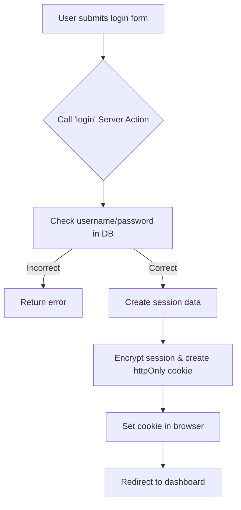
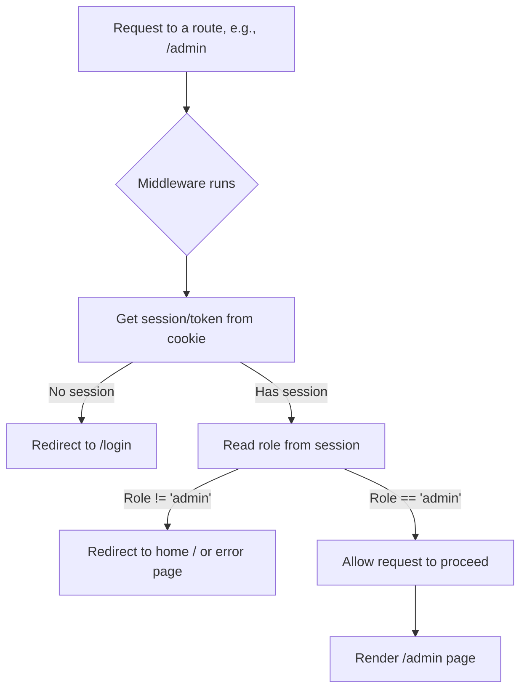

# Next.js Fundamentals Cheatsheet

## 1. What is Next.js?
* A React framework for building full web applications.
* **Key Feature**: **Server-side Rendering (SSR)**. The server generates full HTML, and the browser displays content immediately.
* **Pros**: Great SEO, faster First Contentful Paint.
* **Why Next.js?**
  1. **Hybrid Rendering**: Supports SSR (Server-Side), SSG (Static Site Generation), and CSR (Client-Side).
  2. **File-system Routing**: Folders automatically define routes (no extra setup needed).
  3. **API Routes**: Build backend endpoints within the same project.
  4. **Automatic Optimization**: Built-in optimization for images, fonts, and scripts.

---

## 2. Setup & Installation
* **Prerequisite**: Node.js 18.17 or later.
* **Create a new project**:
  ```bash
  npx create-next-app@latest
  ```
  *(Follow the interactive prompts to configure TypeScript, Tailwind CSS, ESLint, etc.)*
* **Start Development Server**:
  ```bash
  cd my-next-app
  npm run dev
  ```
  *(Runs on `http://localhost:3000`)*

---

## 3. App Router (`app/` directory)
The App Router uses a file-system-based routing model. Folders represent URL segments.

**Special File Conventions**:
* `page.tsx`: The main, unique UI for a specific route.
* `layout.tsx`: Shared UI wrapping multiple pages (e.g., Header, Sidebar).
* `loading.tsx`: Loading UI (uses React Suspense).
* `error.tsx`: Error boundary UI.
* `route.ts`: API endpoints.
* `not-found.tsx`: 404 Not Found UI.
* `metadata.ts`: Manages SEO metadata (title, description).
* `template.tsx`: Similar to layout but re-mounts on navigation.

---

## 4. Layouts & Nested Routing
* Layouts accept a `children` prop.
* They allow creating shared UI elements that **do not re-render** when navigating between child pages.
* Layouts can be nested to create a component hierarchy.
* **Root Layout** (`app/layout.tsx`): Required top-level layout. Must contain `<html>` and `<body>` tags.
* **Nested Layout** (e.g., `app/dashboard/layout.tsx`): Only applies to pages within the `/dashboard` route.

---

## 5. Server vs. Client Components

### Server Components (Default)
* Run **only on the server**.
* **Cannot** use hooks (`useState`, `useEffect`) or browser-only APIs.
* **Best for**: Accessing backend resources directly (Databases, internal APIs), fetching data, and reducing JavaScript bundle size sent to the client.
* All components in the `app/` directory are Server Components by default.

### Client Components
* Require the **`"use client";`** directive at the top of the file.
* Rendered on the server (SSR) and then "hydrated" on the client to become interactive.
* **Best for**: Using hooks, managing state, and handling user events (`onClick`, `onChange`, etc.).

---

## 6. Advanced Routing Techniques

### 1. Dynamic Routes
* Instead of making a separate file for each item, use a template for pages with dynamic data (e.g., blog posts, products).
* Wrap the folder name in square brackets: e.g., `[slug]` or `[userId]`.
* The dynamic value from the URL is passed to the component as a `params` prop.

### 2. Nested Routes and Layouts
* You can nest dynamic routes and layouts to build complex, shared UIs.
* Adding a `layout.tsx` inside a dynamic folder (like `[userId]`) creates a shared UI (e.g., a sidebar) that appears on all sub-pages for that user.

### 3. Catch-all & Optional Catch-all Routes
* **Catch-all Routes (`[...folderName]`)**: Captures all subsequent URL segments.
  * Useful for deep paths like documentation. E.g., `[...slug]` matches `/docs/a` and `/docs/a/b`.
* **Optional Catch-all Routes (`[[...folderName]]`)**: Same as Catch-all, but it **also matches the root path** without any extra segments. 
  * Perfect for optional URL parameters like search filters.

### 4. The `<Link>` Component for Navigation
* The primary way to navigate between pages in Next.js.
* Updates the page content without a full-page reload, making navigation feel instant.
* Next.js automatically **pre-loads** the next page in the background!
* Usage: `<Link href="/path">Click Here</Link>`

### 5. Programmatic Navigation
* Used when you need to redirect a user after an action (like a form submission or login).
* **`useRouter()`**: Hook to trigger navigation via code.
  * Call `router.push('/your-path')`.
  * *Note*: Requires a Client Component (`"use client";`).
* **`usePathname()`**: Hook to get the current URL path string you are on.

---

## 7. Data Fetching Strategies

### 1. The Shift to Server Components
* Previously, React used client-side fetching (`useEffect`), leading to layout shifts and network waterfalls.
* Next.js Server Components fetch data directly on the server **before rendering**.
* **Benefits**: Eliminates client-side processing, hides sensitive API keys, provides fully populated HTML (instant visibility), and ensures superior SEO.
* **Types of Data**:
  * **Static Data**: Fetched once at build time and cached globally (maximum speed).
  * **Dynamic Data**: Fetched on every request (real-time updates).

### 2. Fetching in Server Components (`async/await`)
* By default, all components are Server Components.
* Simply use `async/await` directly inside the component to fetch data.
* Next.js handles the server-side fetch automatically. Recommended for data that doesn't need user interaction.

### 3. Static Generation (`generateStaticParams`)
* **Static Site Generation (SSG)** pre-renders pages at build time.
* For dynamic routes (e.g., `[slug]`), use `generateStaticParams` to tell Next.js which parameters to pre-render.
* It returns an array of `params` objects, generating a static HTML page for each (improves speed and reduces server load).

### 4. Server-Side Rendering (SSR) & Streaming UI
* **SSR**: The default for dynamic pages that aren't statically generated. HTML is generated on the server for *each* request.
* **Streaming UI**: Instead of waiting for the full page to render, Next.js sends a static UI shell (like a layout) with a loading state. As data is fetched, the dynamic content is "streamed" in.
* Achieved using a `loading.tsx` file and React Suspense.

### 5. Client-Side Data Fetching
* Use this for frequently changing data or data depending on user interaction (e.g., a dashboard).
* Requires making the component a Client Component (`"use client";`).
* Can use standard React hooks (`useEffect`, `useState`) or specialized libraries like **SWR** or **React Query** for caching and revalidation.

### 6. Creating API Routes
* Create API endpoints by adding a `route.ts` (or `.js`) file inside a route folder.
* Export async functions named after HTTP methods (`GET`, `POST`, `PUT`, `DELETE`).
* Enables building a full backend directly within your Next.js app to handle client requests or communicate securely with external services.

---

## 8. Performance Optimization Techniques

### 1. Image Optimization with the `<Image>` Component
The Next.js `<Image>` component (`next/image`) is an extension of the HTML `` tag, specifically designed for performance optimization. It automatically performs the following tasks:
* **Resizing**: Creates smaller versions of images for different screen sizes to avoid sending oversized image files to the user's device.
* **Format Optimization**: Automatically converts images to more modern formats like WebP or AVIF (if the browser supports them), which reduces file size while maintaining quality.
* **Lazy Loading**: By default, images are only loaded when they are scrolled into the user's viewport, which speeds up the initial page load.
* **Prevents Cumulative Layout Shift (CLS)**: Automatically sets dimensions for the image so the browser can reserve space for it before it finishes loading, preventing content from suddenly "jumping."

### 2. Code Splitting & Parallel Loading
* **Automatic Code Splitting**: Next.js intelligently performs code splitting out of the box. Each `page.tsx` file in the App Router is compiled into its own JavaScript "bundle." This means that when a user visits a page, they only download the code necessary for that specific page, not the entire application.
* **Parallel Route Loading**: When a URL is requested, Next.js will load all the necessary `layout.tsx` and `page.tsx` files for that route in parallel. For example, when accessing `/dashboard/settings`, the root layout, the dashboard layout, and the settings page will all be fetched and rendered simultaneously on the server, minimizing wait times.
* *Note*: This is an automatic behavior; you don't need any extra configuration. Simply structuring your application according to the App Router conventions enables this feature.

### 3. React Suspense and Lazy Loading with Loading UI
* React Suspense is a React feature that lets components "wait" for something (like data) before they render. Next.js deeply integrates with Suspense to create a better user experience through **Streaming**.
* By creating a `loading.tsx` file, you are telling Next.js: "While the main page component (`page.tsx`) is busy fetching data, show the UI from this `loading.tsx` file as a temporary placeholder." This allows the user to immediately see part of the page and know that content is on its way, instead of staring at a blank screen.

### 4. Caching Strategies and ISR
Next.js extends JavaScript's `fetch` function with a powerful server-side caching system.
* **Static Fetch (Default)**: `fetch('...')` will automatically cache the result indefinitely. This is similar to `getStaticProps` in the Pages Router. The data is fetched at build time and reused for every request.
* **No-cache Fetch**: `fetch('...', { cache: 'no-store' })` will always fetch fresh data for every request. This is similar to `getServerSideProps`.
* **Incremental Static Regeneration (ISR)**: `fetch('...', { next: { revalidate: 60 } })` is the best of both worlds. It caches data for a specific time period (e.g., 60 seconds). The first request within that window gets the cached data, while Next.js triggers a "revalidation" in the background to fetch fresh data. Subsequent requests will receive the updated data.

### 5. Monitoring and Improving Core Web Vitals
Core Web Vitals (CWV) are a set of three metrics from Google used to measure real-world user experience on a website, focusing on loading speed, interactivity, and visual stability.
1. **Largest Contentful Paint (LCP)**: Measures the time it takes for the largest content element (usually an image or text block) to become visible. Next.js helps improve LCP with the `<Image>` component.
2. **Interaction to Next Paint (INP)**: Measures the latency from a user interaction (click, tap, key press) until the UI provides feedback. Next.js helps improve INP with code splitting, loading only necessary JS. (INP has replaced First Input Delay - FID).
3. **Cumulative Layout Shift (CLS)**: Measures how much the layout "jumps" unexpectedly during loading. Next.js helps reduce CLS by automatically sizing images and fonts.

You can monitor these metrics using tools like Google PageSpeed Insights or by integrating Vercel Analytics into your project.

**Metrics Diagram**:
* **LCP (Loading)**: "Does the page load fast?" -> `<Image>`, Font Optimization.
* **INP (Interactivity)**: "Does the page respond quickly?" -> Code Splitting.
* **CLS (Stability)**: "Is the layout stable?" -> `<Image>`, Font Optimization.

---

## 9. Styling and CSS in Next.js

### 1. Using CSS Modules
CSS Modules are a way to write CSS that is locally scoped to a specific component. When you import a CSS Module file, Next.js automatically generates unique classnames, which helps you avoid class name conflicts between different components. This is the built-in and recommended way to handle component-level styling in Next.js. To use it, you just need to name your file with the `[name].module.css` convention.

### 2. Example

#### 1. CSS Module File (`Button.module.css`)
```css
/* app/components/Button.module.css */
.btn {
  background-color: blue;
  color: white;
  padding: 10px 20px;
  border-radius: 5px;
}
```

#### 2. Using it in a Component (`Button.tsx`)
```tsx
// app/components/Button.tsx
import styles from './Button.module.css';

export default function Button() {
  return (
    <button className={styles.btn}>Click me!</button>
  );
}
```

### 3. Integrating Sass/SCSS
Sass/SCSS is a CSS preprocessor that extends the capabilities of CSS with features like:
* **Variables**: To store reusable values (colors, font sizes).
* **Nesting**: Write CSS rules nested within each other, following the HTML structure.
* **Mixins**: Create reusable blocks of styles.
* **Partials & Imports**: Split CSS into manageable modules.

**Installation**:
```bash
npm install sass
# or
yarn add sass
```

### 4. Sass/SCSS - Example
```
app/
├── styles/
│   └── _variables.scss  // File for global variables
└── components/
    ├── Card.jsx
    └── Card.module.scss // Using SCSS for the module
```

`app/styles/_variables.scss`
```scss
// Define global variables
$primary-color: #8a2be2;
$border-radius: 12px;
$card-shadow: 0 4px 12px rgba(0, 0, 0, 0.1);
```

`app/components/Card.module.scss`
```scss
// Import variables from the partial file
@import '../styles/variables';

.card {
  padding: 1.5rem;
  border-radius: $border-radius;
  box-shadow: $card-shadow;
  background-color: white;

  h3 {
    margin-top: 0;
    color: $primary-color;
  }

  p {
    color: #555;
  }
}
```

`app/components/Card.jsx`
```jsx
// Usage is no different from regular CSS Modules
import styles from './Card.module.scss';

export default function Card({ title, content }) {
  return (
    <div className={styles.card}>
      <h3>{title}</h3>
      <p>{content}</p>
    </div>
  );
}
```

### 5. Styled-components with Server Components
Styled-components is a CSS-in-JS library that allows you to write CSS directly in your JavaScript/TypeScript files using tagged template literals.
* **Advantages**: Dynamic styling based on props, automatic scoping, no need to worry about class names.

**Challenge with the App Router**: Styled-components requires a browser runtime environment to inject styles into the DOM. However, Server Components are rendered entirely on the server, where this environment doesn't exist.

**Solution**:
1. All components using styled-components must be Client Components (marked with `'use client'`).
2. A Style Registry needs to be created to collect all the styles generated during the server render, and then inject them into the `<head>` of the HTML file sent to the client.

### 6. Styled-components - Installation & Example
**Install the library**:
```bash
npm install styled-components
```

**Create the file** `app/lib/StyledComponentsRegistry.jsx`:
```jsx
'use client'

import React, { useState } from 'react'
import { useServerInsertedHTML } from 'next/navigation'
import { ServerStyleSheet, StyleSheetManager } from 'styled-components'

export default function StyledComponentsRegistry({ children }) {
  const [styledComponentsStyleSheet] = useState(() => new ServerStyleSheet())

  useServerInsertedHTML(() => {
    const styles = styledComponentsStyleSheet.getStyleElement()
    styledComponentsStyleSheet.instance.clearTag()
    return <>{styles}</>
  })

  if (typeof window !== 'undefined') return <>{children}</>

  return (
    <StyleSheetManager sheet={styledComponentsStyleSheet.instance}>
      {children}
    </StyleSheetManager>
  )
}
```

### 7. Installation & Example (cont.)
**3. Use the Registry in the Root Layout (`app/layout.jsx`)**:
```jsx
import StyledComponentsRegistry from './lib/StyledComponentsRegistry';

export default function RootLayout({ children }) {
  return (
    <html>
      <body>
        <StyledComponentsRegistry>{children}</StyledComponentsRegistry>
      </body>
    </html>
  );
}
```

`app/components/StyledButton.jsx`
```jsx
'use client'; // MUST be a Client Component

import styled from 'styled-components';

// Dynamic style based on the 'primary' prop
const Button = styled.button`
  background: ${props => props.$primary ? '#BF4F74' : 'white'};
  color: ${props => props.$primary ? 'white' : '#BF4F74'};
  font-size: 1em;
  margin: 1em;
  padding: 0.5em 1.5em;
  border: 2px solid #BF4F74;
  border-radius: 5px;
  cursor: pointer;
`;

export default function StyledButton({ primary, children }) {
  // Note: styled-components recommends using props with a $ prefix
  // to avoid them being passed down to the DOM element unnecessarily.
  return <Button $primary={primary}>{children}</Button>
}
```

### 8. Tailwind CSS in the App Router
Tailwind CSS is a utility-first framework. Instead of writing custom CSS, you build interfaces by applying pre-existing utility classes directly in your JSX.
* **Advantages**: Extremely fast UI development, consistent, easily customizable, and automatically purges unused CSS for production optimization.

**Installation & Configuration**: (According to the official Tailwind documentation)
1. **Install necessary packages**:
```bash
npm install -D tailwindcss postcss autoprefixer
```
2. **Initialize configuration files**:
```bash
npx tailwindcss init -p
```

### 9. Adding Custom Tailwind CSS Classes
To maintain a consistent design system, you'll often need to add custom values (like brand colors, fonts, or animations) to Tailwind. This is done in the `tailwind.config.ts` file.

The best practice is to add your customizations inside the `theme.extend` object. This adds to Tailwind's default theme instead of completely replacing it. Once defined, you can use these classes anywhere in your application.

---

## 10. State Management in Next.js Applications

### 1. Overview - Challenges in Next.js
In the Next.js App Router, state management is more complex due to the separation between Server and Client.
* **Server Components**:
  * Run on the server, are stateless, and cannot use hooks like `useState` or `useEffect`.
  * Ideal for data fetching and accessing the backend.
  * Cannot directly interact with client-side state.
* **Client Components** (`"use client"`):
  * Behave like traditional React components.
  * Can use hooks, manage state, and handle events.
  * All state management libraries (Context, Redux, Zustand) must be used within Client Components.
* **Hydration**:
  * The process of 'breathing life' into static server-rendered HTML by attaching JavaScript event listeners and state on the client, making the page interactive.
  * Synchronizing the initial state between the server and client is crucial to avoid errors.

### 2. React Context & Server Components
The React Context API is a way to share state between components without having to pass props down through multiple levels (prop drilling).
* **Pros**:
  * Built into React, no extra libraries needed.
  * Easy to learn and use for small to medium-sized applications.
  * Excellent for state that changes infrequently, like themes (light/dark mode), language, or user information.
* **Cons**:
  * Can cause unnecessary re-renders for all consuming components when the state changes.
  * Not optimized for frequent and complex state updates.
* **Note in Next.js**:
  * The Context Provider MUST be placed within a Client Component (`"use client"`).

**Flow**:
1. RootLayout (Server) renders the ThemeProvider.
2. ThemeProvider (Client) creates the state and provides it via the Context.
3. The children (which can be Server or Client Components) are rendered inside the Provider.
4. Only Client Components within the tree can access the state from the Context (e.g., ThemeToggleButton).

**Example**:
```jsx
// contexts/ThemeContext.jsx
'use client';

import { createContext, useState, useContext } from 'react';

// Create Context
const ThemeContext = createContext();

// Create Provider Component
export function ThemeProvider({ children }) {
  const [theme, setTheme] = useState('light');

  const toggleTheme = () => {
    setTheme((prevTheme) => (prevTheme === 'light' ? 'dark' : 'light'));
  };

  return (
    <ThemeContext.Provider value={{ theme, toggleTheme }}>
      {children}
    </ThemeContext.Provider>
  );
}

// Create a custom hook for easy consumption
export function useTheme() {
  return useContext(ThemeContext);
}
```

```jsx
// app/layout.js
import { ThemeProvider } from '@/contexts/ThemeContext';

export default function RootLayout({ children }) {
  return (
    <html lang="en">
      <body>
        <ThemeProvider>{children}</ThemeProvider>
      </body>
    </html>
  );
}
```

```jsx
// components/ThemeSwitcher.jsx
'use client';

import { useTheme } from '@/contexts/ThemeContext';

export default function ThemeSwitcher() {
  const { theme, toggleTheme } = useTheme();

  return (
    <button onClick={toggleTheme} className={`p-2 rounded ${theme === 'light' ? 'bg-gray-800 text-white' : 'bg-white text-black'}`}>
      Switch to {theme === 'light' ? 'Dark' : 'Light'} Mode
    </button>
  );
}
```

### 3. Redux Toolkit & App Router
Redux Toolkit (RTK) is the official, recommended toolset for writing Redux logic. It simplifies store setup and reducer creation.
* **Pros**:
  * Centralized, predictable state management.
  * Powerful ecosystem (DevTools, middleware like Redux Thunk/Saga).
  * Performance optimizations with reselect and Immer.
  * Suitable for large, complex applications with a lot of global state.
* **Cons**:
  * Still has some boilerplate (though significantly reduced by RTK).
  * Steeper learning curve compared to other solutions.
* **Note in Next.js**: Similar to Context, the Redux store only exists on the client side. The Provider must also be placed in a Client Component.

**Flow**:
1. The store is created once on the client side.
2. The `StoreProvider` (Client) provides this store to the component tree.
3. Child Client Components can interact with the store using the `useDispatch` and `useSelector` hooks.

```
(Server) RootLayout
└── (Client) "use client" <StoreProvider>
    └── (Server) {children} - (e.g., DashboardPage)
        └── (Client) "use client" <CounterComponent />
```

**1. Installation**:
```bash
npm install @reduxjs/toolkit react-redux
```

**2. Create a Slice (`/lib/features/counter/counterSlice.js`)**:
```javascript
import { createSlice } from '@reduxjs/toolkit';

const initialState = { value: 0 };

const counterSlice = createSlice({
  name: 'counter',
  initialState,
  reducers: {
    increment: (state) => {
      state.value += 1;
    },
    decrement: (state) => {
      state.value -= 1;
    },
  },
});

export const { increment, decrement } = counterSlice.actions;
export default counterSlice.reducer;
```

**3. Create the Store (`/lib/store.js`)**:
```javascript
import { configureStore } from '@reduxjs/toolkit';
import counterReducer from './features/counter/counterSlice';

export const makeStore = () => {
  return configureStore({
    reducer: {
      counter: counterReducer,
    },
  });
};
```

**4. Create the Provider (`/app/StoreProvider.jsx`)**:
```jsx
'use client';

import { useRef } from 'react';
import { Provider } from 'react-redux';
import { makeStore } from '../lib/store';

export default function StoreProvider({ children }) {
  const storeRef = useRef(null);
  if (!storeRef.current) {
    // Create a new store instance the first time this renders
    storeRef.current = makeStore();
  }

  return <Provider store={storeRef.current}>{children}</Provider>;
}
```

**5. Use in `layout.js` and a component**:
```jsx
// app/layout.js
import StoreProvider from './StoreProvider';

export default function RootLayout({ children }) {
  return (
    <html lang="en">
      <body>
        <StoreProvider>{children}</StoreProvider>
      </body>
    </html>
  );
}
```

```jsx
// components/Counter.js
'use client';
import { useSelector, useDispatch } from 'react-redux';
import { increment, decrement } from '@/lib/features/counter/counterSlice';

export function Counter() {
  const count = useSelector((state) => state.counter.value);
  const dispatch = useDispatch();

  return (
    <div>
      <button onClick={() => dispatch(decrement())}>-</button>
      <span>{count}</span>
      <button onClick={() => dispatch(increment())}>+</button>
    </div>
  );
}
```

### 4. Recoil & Zustand
These are modern, minimalist, hook-based state management libraries.

**Zustand**
* **'Zustand'** means 'state' in German.
* Extremely simple with minimal boilerplate.
* State is stored in a store outside of React, accessed via hooks.
* No need to wrap the application in a Provider.
* **Best for**: Projects of all sizes that need a lightweight, easy-to-use solution.

**Recoil**
* Developed by Facebook.
* Uses the concepts of 'atoms' (individual units of state) and 'selectors' (derived state).
* Allows for better re-render optimization as components subscribe only to the atoms they need.
* **Best for**: Complex applications that need to efficiently manage interdependent states. Requires a Provider (`RecoilRoot`).

**Persist State**
The fundamental problem that state persistence solves is the temporary nature of state held in memory. By default, when you create state with Zustand (or any other state management library), it's stored in the browser's JavaScript memory. This means:
* When a user reloads the page (F5), all JavaScript memory is wiped clean and re-initialized.
* When a user closes the tab or browser, that memory is completely destroyed.

As a result, the application's entire state reverts to its initial value. This creates a very poor user experience in many common scenarios, for example:
* **Shopping Cart**: A customer adds five items to their cart, accidentally reloads the page, and finds their cart is completely empty.
* **User Preferences**: A user selects dark mode, but when they return to the site later, the interface has reverted to light mode.
* **Form Data**: A user is filling out a long form, but accidentally closes the tab and has to start all over from scratch.

State persistence is the solution to this problem. It takes state from temporary memory and saves it to a more durable storage location on the user's device.

**Configuring State Persistence with Zustand**:
1. **Create the Persisted Store**: Use the `persist` middleware and provide a unique name to act as the key in localStorage. This automatically saves and rehydrates your state. (`stores/settingsStore.ts`)
2. **Handle Hydration in Next.js / SSR**: Delay rendering UI that uses the store until the component has mounted on the client. This prevents a "hydration mismatch" error between the server and client. (`components/ThemeSwitcher.tsx`)

### 5. Handling State Hydration
Hydration is the process where client-side React takes over the HTML rendered by the server.

**The Problem**: If the initial state on the client does not match what was rendered on the server, React will throw a "Hydration Mismatch" error.
* **Example**: The server renders a page with a 'light' theme, but the client initializes the theme state as 'dark' (e.g., from localStorage).

**The Solution**: Pass the initial state from a Server Component down to a Client Component as props. The Client Component will use these props to initialize its state, ensuring consistency.

**Correct Hydration Flow Diagram**:
1. **Server**: ServerComponent fetches data (`initialTodos`).
2. **Server -> Client**: Pass `initialTodos` via props to ClientComponent.
3. **Client**: ClientComponent receives `initialTodos` and uses it as the initial value for `useState`. `const [todos, setTodos] = useState(initialTodos)`.
4. **Result**: The server-rendered HTML and the initial client-side state match. Hydration succeeds!

---

## 11. Authentication & Authorization

### 1. Overview: Core Concepts
**Authentication**
* **What is it?** Answers the question: "Who are you?"
* **Purpose**: To verify a user's identity, typically via username/password, social accounts, etc.
* **Example**: Logging into Gmail.

**Authorization**
* **What is it?** Answers the question: "What are you allowed to do?"
* **Purpose**: To determine the access rights of an authenticated user.
* **Example**: Only an admin can access the admin dashboard.

### 2. Setting Up NextAuth.js in the App Router
NextAuth.js (Auth.js) is the most comprehensive and popular solution for authentication in Next.js.
**Advantages**:
* Supports multiple "Providers" (Google, GitHub, credentials...).
* Easy to set up, minimizing boilerplate code.
* Automatically manages sessions and secure cookies.
* Deeply integrated with Next.js (both Pages and App Router).

**Flow**:
```
participant User
participant Client as Browser (Next.js App)
participant Server as Next.js Server (Route Handler)
participant Provider as Google/GitHub

User->>Client: 1. Clicks "Sign in with Google"
Client->>Server: 2. Calls signIn('google')
Server->>Provider: 3. Redirects to Google sign-in page
Provider-->>User: 4. Requests authentication
User->>Provider: 5. Signs in successfully
Provider-->>Server: 6. Sends back authorization code
Server->>Provider: 7. Exchanges code for access token
Server->>Server: 8. Creates session & saves to cookie
Server-->>Client: 9. Returns session to client
Client-->>User: 10. Displays "Signed in" status
```

### 3. Example: Setting up NextAuth.js

**1. Installation**:
```bash
npm install next-auth
```

**2. Create Route Handler**: `app/api/auth/[...nextauth]/route.ts`
```typescript
// app/api/auth/[...nextauth]/route.ts
import NextAuth from "next-auth"
import GoogleProvider from "next-auth/providers/google"
import CredentialsProvider from "next-auth/providers/credentials";

const handler = NextAuth({
  providers: [
    GoogleProvider({
      clientId: process.env.GOOGLE_CLIENT_ID!,
      clientSecret: process.env.GOOGLE_CLIENT_SECRET!,
    }),
    CredentialsProvider({
      // ... configuration for username/password login
    })
  ],
  pages: { signIn: '/login' }, // Custom sign-in page
})

export { handler as GET, handler as POST }
```

**3. Using the Session in a Component**:
```tsx
// components/SomeComponent.tsx (Server Component)
import { auth } from "@/auth" // Assuming auth.ts is the config file

export default async function SomeComponent() {
  const session = await auth(); // Get session on the server
  if (session) {
    return <p>Signed in as {session.user?.email}</p>
  }
  return <p>Not signed in</p>
}
```

### 4. Building a Custom Auth with Server Actions
For cases where you want full control over the authentication logic.
**When to use it?**
* Proprietary authentication systems, not using OAuth.
* Need deep integration with an existing database.
* Don't want to depend on a third-party library.

**Approach**:
* A login form calls a Server Action.
* The Server Action handles logic: checks DB, hashes passwords.
* On success, create a session (e.g., using iron-session) and save it in a secure (httpOnly) cookie.

**Custom Auth Flow with Server Actions**:


**Example: Custom Auth with Server Actions**
Use a library like `jose` to create a JWT or `iron-session` to encrypt the cookie.

```typescript
// app/login/actions.ts
'use server'

import { sealData } from 'iron-session/edge';
import { cookies } from 'next/headers';
import { redirect } from 'next/navigation';

export async function login(formData: FormData) {
  const email = formData.get('email');
  // 1. Get user from DB
  // const user = await getUserByEmail(email);

  // 2. Verify password (e.g., using bcrypt.compare)
  // const isValid = await compare(password, user.password);

  // Assume successful authentication
  const user = { id: 1, email, isAdmin: true };

  // 3. Create a secure session
  const session = await sealData(user, {
    password: process.env.SECRET_COOKIE_PASSWORD!,
  });

  // 4. Set the cookie
  cookies().set('session', session, {
    httpOnly: true,
    secure: process.env.NODE_ENV === 'production',
    maxAge: 60 * 60 * 24 * 7, // 1 week
    path: '/',
  });

  // 5. Redirect
  redirect('/dashboard');
}
```

### 5. Implementing JWT Authentication & Secure APIs
* **JWT (JSON Web Token)** is an encoded JSON string used to securely exchange information between parties.
* **Structure**: Header, Payload (data), Signature. The signature ensures the token hasn't been tampered with.
* **Application**: Ideal for protecting API Routes or Route Handlers in Next.js. The client sends the JWT with each request to prove it's authenticated.

**API Security Flow with JWT**:
```
participant Client
participant API as Next.js API Route
participant AuthServer as Server (Login)

Client->>AuthServer: 1. Login (username, password)
AuthServer-->>Client: 2. Returns JWT
Client->>Client: 3. Store JWT (localStorage/cookie)

loop For each request to a protected API
    Client->>API: 4. Send request + JWT in Header (Authorization: Bearer <token>)
    API->>API: 5. Verify JWT signature
    alt Signature valid
        API-->>Client: 6a. Return data successfully
    else Signature invalid/expired
        API-->>Client: 6b. Return 401 Unauthorized error
    end
end
```

**Example: Protecting an API Route Handler**:
```typescript
// app/api/secure-data/route.ts
import { NextRequest, NextResponse } from 'next/server';
import { jwtVerify } from 'jose';

const JWT_SECRET = new TextEncoder().encode(process.env.JWT_SECRET!);

export async function GET(req: NextRequest) {
  const authHeader = req.headers.get('authorization');

  if (!authHeader || !authHeader.startsWith('Bearer ')) {
    return NextResponse.json({ message: 'Unauthorized' }, { status: 401 });
  }

  const token = authHeader.split(' ')[1];

  try {
    // Verify the token
    const { payload } = await jwtVerify(token, JWT_SECRET);
    console.log('JWT Payload:', payload);

    // Logic to execute when the token is valid
    return NextResponse.json({
      data: `Secret data for user ID: ${payload.sub}`,
    });
  } catch (error) {
    // Token is invalid or has expired
    return NextResponse.json({ message: 'Invalid token' }, { status: 401 });
  }
}
```

### 6. Role-Based Access Control (RBAC)
RBAC is a method of restricting system access for authenticated users based on their roles (e.g., admin, editor, user).
How to implement in Next.js:
* **Middleware (`middleware.ts`)**: Acts as a "gatekeeper". It runs before a request is processed. Ideal for checking roles and redirecting if unauthorized.
* **Layouts**: Apply to a group of routes. Can be used to wrap pages that require specific permissions, show different UIs, or check permissions at the layout level.

**Authorization Flow with Middleware**:


**Example: Authorization with Middleware**:
```typescript
// middleware.ts (place in the root directory)
import { NextResponse } from 'next/server';
import type { NextRequest } from 'next/server';
import { getIronSession } from 'iron-session/edge';

export async function middleware(req: NextRequest) {
  const res = NextResponse.next();
  const session = await getIronSession(req, res, {
    cookieName: 'session',
    password: process.env.SECRET_COOKIE_PASSWORD!,
  });

  const { user } = session;

  // If accessing an admin page but is not an admin
  if (req.nextUrl.pathname.startsWith('/admin') && user?.isAdmin !== true) {
    return NextResponse.redirect(new URL('/', req.url)); // Redirect to home page
  }

  // If not logged in but accessing a protected page
  if (req.nextUrl.pathname.startsWith('/dashboard') && !user) {
    return NextResponse.redirect(new URL('/login', req.url));
  }

  return res;
}

export const config = {
  matcher: ['/admin/:path*', '/dashboard/:path*'], // Routes to apply the middleware to
};
```

---

## 12. Testing Next.js Applications

### 1. Introduction & Objectives
**Why is Testing Important?**
* **Ensure Quality**: Detect bugs early, before they reach the user.
* **Increase Confidence**: Be more confident when refactoring code or adding new features.
* **Living Documentation**: Tests act as documentation describing how the code works.
* **Improve Architecture**: Writing testable code often leads to better application architecture.

**Agenda**
1. Unit Testing: With Jest for Server & Client Components.
2. Integration Testing: With React Testing Library.
3. End-to-End Testing: Using Cypress.
4. Testing the Backend: API Routes & Server Actions.

### 2. The Testing Pyramid
The Testing Pyramid is a model that helps visualize different levels of testing and their recommended proportions.
**Visual**: Imagine a pyramid with three levels.
* **Bottom (Widest)**: Unit Tests (Most numerous, fast, cheap)
* **Middle**: Integration Tests
* **Top (Smallest)**: End-to-End (E2E) Tests (Fewest, slow, expensive)

* **Unit Tests** (Most numerous): Test the smallest units of code (functions, components) in isolation. Very fast and low cost.
* **Integration Tests** (Moderate amount): Test the interaction between multiple units.
* **E2E Tests** (Fewest): Test the entire application flow from start to finish, simulating real user behavior. Slow and high cost.

### 3. Unit Testing with Jest
* **Objective**: Test a component or function individually, isolated from other parts of the application.
* **Tools**:
  * **Jest**: A powerful and easy-to-set-up JavaScript testing framework.
  * **React Testing Library (RTL)**: Provides utilities to render components and interact with them the way a user would.

**Unit Test Workflow**
`Test File` → `Jest Runner` → `Render Component` → `Simulate Interaction` → `Assert Result`

#### 3.1. Unit Testing - Client Component Example

**Component to test (`Counter.tsx`)**:
```tsx
'use client';
import { useState } from 'react';

export default function Counter() {
  const [count, setCount] = useState(0);
  return (
    <div>
      <p>Count: {count}</p>
      <button onClick={() => setCount(count + 1)}>Increment</button>
    </div>
  );
}
```

**Test File (`Counter.test.tsx`)**:
```tsx
import { render, screen, fireEvent } from '@testing-library/react';
import Counter from './Counter';

describe('Counter Component', () => {
  it('should render initial count and increment on click', () => {
    // 1. Render component
    render(<Counter />);

    // 2. Find elements on the DOM
    const countElement = screen.getByText(/Count: 0/i);
    const button = screen.getByRole('button', { name: /Increment/i });

    // 3. Assertion: Check the initial state
    expect(countElement).toBeInTheDocument();

    // 4. Action: Simulate a user click event
    fireEvent.click(button);
  });
});
```

#### 3.2. Unit Testing - Server Component Example

**Component to test (`UserProfile.tsx`)**:
```tsx
// Server Component without 'use client'
type User = { id: number; name: string; email: string };

export default async function UserProfile({ userId }: { userId: number }) {
  // Assume this function fetches data from an API
  const fetchUser = async (id: number): Promise<User> => {
    return { id, name: 'Leanne Graham', email: 'Sincere@april.biz' };
  };

  const user = await fetchUser(userId);

  return (
    <div>
      <h1>{user.name}</h1>
      <p>{user.email}</p>
    </div>
  );
}
```

**Test File (`UserProfile.test.tsx`)**:
*Note: We are not testing the data fetching, only that the UI renders correctly with the provided data.*
```tsx
import { render, screen } from '@testing-library/react';
// Server component needs to be rendered in the test environment
import UserProfile from './UserProfile';

// TypeScript will error because we are passing an async component to render.
// To solve this, we can use a small trick.
const Resolved = async ({ children }: { children: React.ReactNode }) => await children;

describe('UserProfile Server Component', () => {
  it('renders user data correctly', async () => {
    // Render the async component
    render(<Resolved><UserProfile userId={1} /></Resolved>);

    // Wait and find the elements
    const nameElement = await screen.findByRole('heading', { name: /Leanne Graham/i });
    const emailElement = await screen.findByText(/Sincere@april.biz/i);

    // Assertion
    expect(nameElement).toBeInTheDocument();
    expect(emailElement).toBeInTheDocument();
  });
});
```

### 4. Integration Testing with React Testing Library
**Objective**: Test how multiple components work together as a complete functional block. For example: a form and the success message after submission.
**Tools**: Still Jest and React Testing Library.
**Difference from Unit Test**: Instead of rendering a single component, we render a group of components (often an entire page) and test the interaction flow between them.

**Integration Test Workflow**
`Test File` → `Render Page (with multiple components)` → `Simulate User Flow` → `Assert Final State`

#### 4.1 Integration Testing - Example

**Components to test (`NewsletterForm.tsx` and `page.tsx`)**:
```tsx
// NewsletterForm.tsx
'use client';

export default function NewsletterForm({ setSuccess }: { setSuccess: (success: boolean) => void }) {
  const handleSubmit = (e: React.FormEvent) => {
    e.preventDefault();
    setSuccess(true);
  };
  return (
    <form onSubmit={handleSubmit}>
      <input type="email" placeholder="Enter your email" required />
      <button type="submit">Subscribe</button>
    </form>
  );
}
```

```tsx
// page.tsx
'use client';
import { useState } from 'react';
import NewsletterForm from './NewsletterForm';

export default function Home() {
  const [success, setSuccess] = useState(false);
  return (
    <main>
      <h1>Join our Newsletter</h1>
      {success ? (
        <p>Thank you for subscribing!</p>
      ) : (
        <NewsletterForm setSuccess={setSuccess} />
      )}
    </main>
  );
}
```

**Test File (`Home.test.tsx`)**:
```tsx
import { render, screen, fireEvent } from '@testing-library/react';
import Home from './page';

describe('Newsletter Subscription Flow', () => {
  it('shows a success message after form submission', () => {
    render(<Home />);

    // Find the input and button
    const emailInput = screen.getByPlaceholderText(/enter your email/i);
    const subscribeButton = screen.getByRole('button', { name: /subscribe/i });

    // Fill the form and submit
    fireEvent.change(emailInput, { target: { value: 'test@example.com' } });
    fireEvent.click(subscribeButton);

    // Check that the success message appears
    const successMessage = screen.getByText(/Thank you for subscribing!/i);
    expect(successMessage).toBeInTheDocument();

    // (Optional) Check that the form has disappeared
    expect(emailInput).not.toBeInTheDocument();
  });
});
```

### 5. End-to-End (E2E) Testing with Cypress
* **Objective**: Simulate a real user, testing the entire application from the user interface (frontend) to the server (backend) in a real browser.
* **Tool**: Cypress.
* **Advantages**: Comprehensively tests the most critical flows (registration, payment, etc.). Ensures all parts of the system work well together.

**E2E Test Workflow**
`Cypress Runner` → `Controls Real Browser` → `Visits Page` → `Clicks, Types, Interacts` → `Asserts Content on Page`

#### 5.1 E2E Testing - Example
```typescript
// cypress/e2e/navigation.cy.ts

describe('Page Navigation', () => {
  it('should navigate from home to the about page', () => {
    // 1. Start from the home page
    cy.visit('http://localhost:3000/');

    // 2. Find a link with an href containing 'about' and click it
    cy.get('a[href*="about"]').click();

    // 3. The new URL should include '/about'
    cy.url().should('include', '/about');

    // 4. The new page should have an h1 heading containing "About Us"
    cy.get('h1').contains('About Us');
  });
});
```
**How to run**:
1. Start the Next.js dev server: `npm run dev`
2. Open Cypress: `npx cypress open`
3. Select the test file and watch it run live in the browser.

### 6. Testing API Routes & Server Actions
* **Objective**: Test the backend logic of Next.js without going through the UI.
* **Methods**:
  * **API Routes**: Directly call the handler function with mocked `req` and `res` objects.
  * **Server Actions**: Since they are just async functions, we can import and call them directly in the test.
* **Tools**: Jest and the `node-mocks-http` library to mock requests/responses.

**API Route Test Workflow**
`Test File` → `Calls API Handler` → `Provide Mock Request` → `Assert Mock Response (status, body)`

#### Testing - API Route Example

**API Route to test (`/api/hello/route.ts`)**:
```typescript
// app/api/hello/route.ts
import { NextResponse } from 'next/server';

export async function GET(request: Request) {
  return NextResponse.json({ message: 'Hello, World!' });
}
```

**Test File (`hello.test.ts`)**:
```typescript
import { GET } from '@/app/api/hello/route';
import { NextRequest } from 'next/server';

describe('API Route: /api/hello', () => {
  it('should return a hello world message', async () => {
    // Mock a simple NextRequest
    const request = new NextRequest('http://localhost/api/hello');

    // Call the handler function
    const response = await GET(request);

    // Get the JSON data from the response
    const body = await response.json();

    // Assertion
    expect(response.status).toBe(200);
    expect(body).toEqual({ message: 'Hello, World!' });
  });
});
```

#### Testing - Server Action Example

**Server Action to test (`actions.ts`)**:
```typescript
'use server';

// Assume this is a function that interacts with a database
const db = {
  items: [] as string[],
  addItem: async (item: string) => {
    db.items.push(item);
    return { success: true };
  },
};

export async function createItem(formData: FormData) {
  const item = formData.get('item')?.toString();

  if (!item) {
    return { success: false, error: 'Item is required' };
  }

  return await db.addItem(item);
}
```

**Test File (`actions.test.ts`)**:
```typescript
import { createItem } from './actions';

describe('Server Action: createItem', () => {
  it('should return an error if item is missing', async () => {
    const formData = new FormData(); // Empty FormData
    const result = await createItem(formData);

    expect(result).toEqual({ success: false, error: 'Item is required' });
  });

  it('should add an item successfully', async () => {
    const formData = new FormData();
    formData.append('item', 'New Test Item');

    const result = await createItem(formData);

    expect(result).toEqual({ success: true });
  });
});
```
