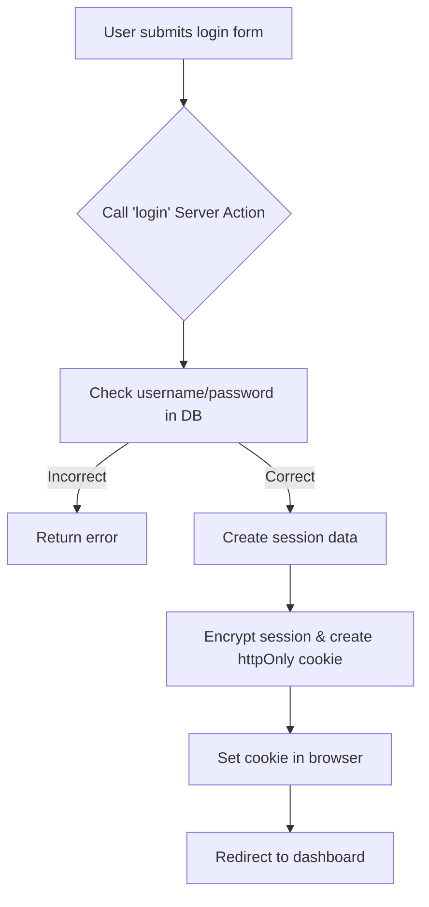
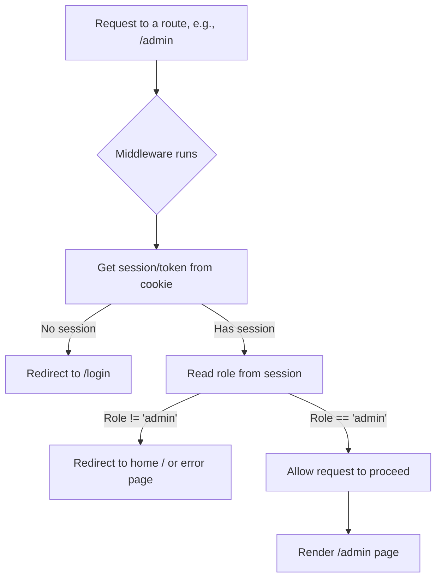
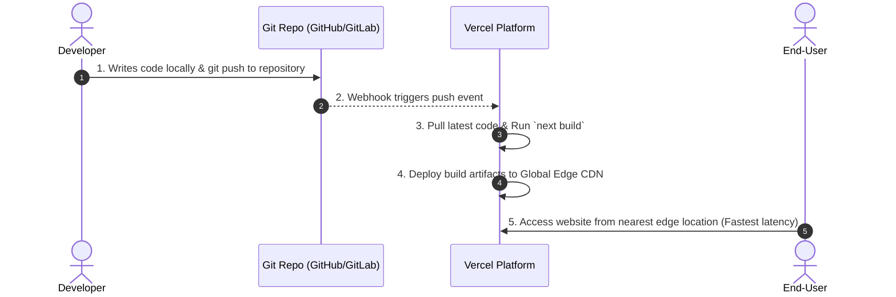
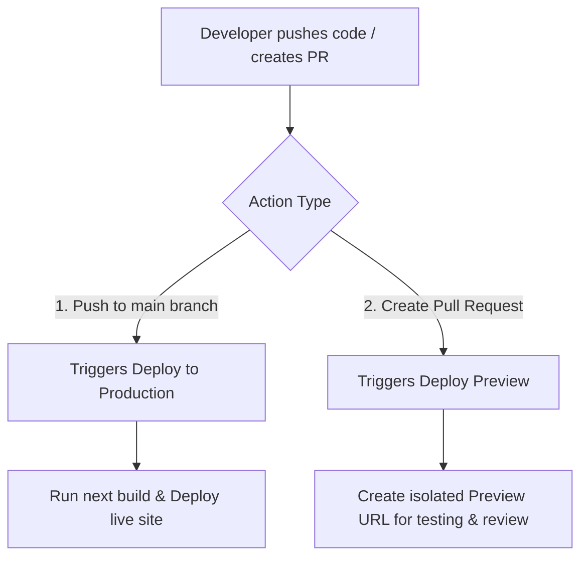
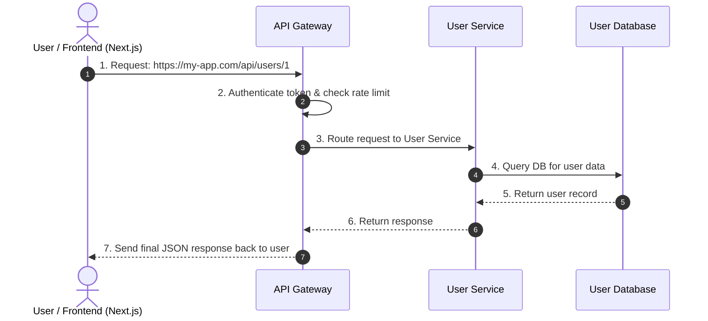
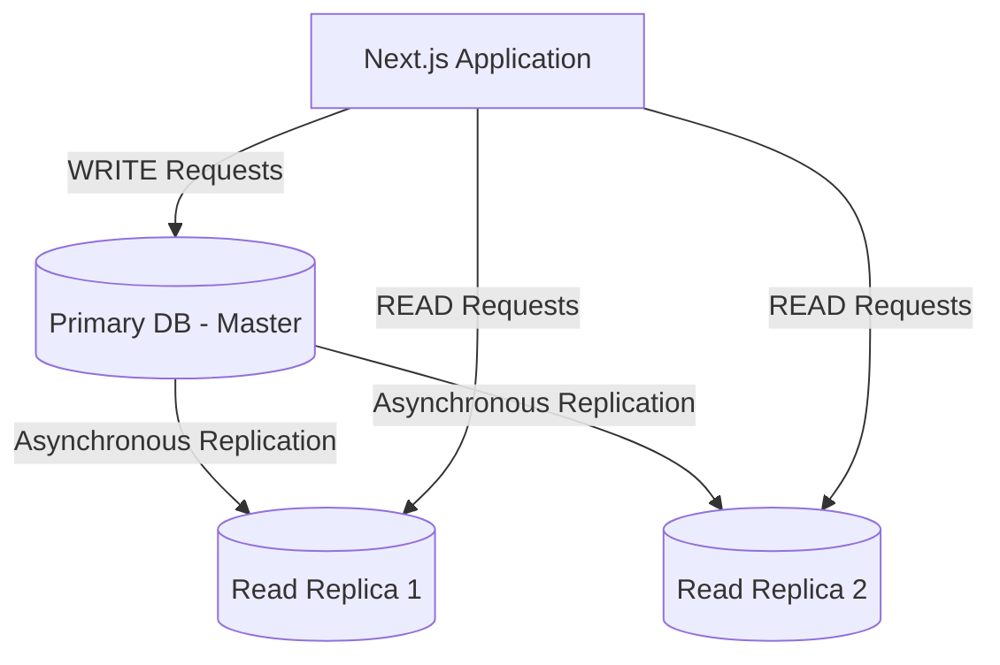
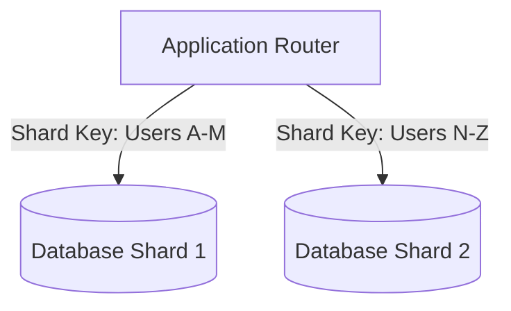
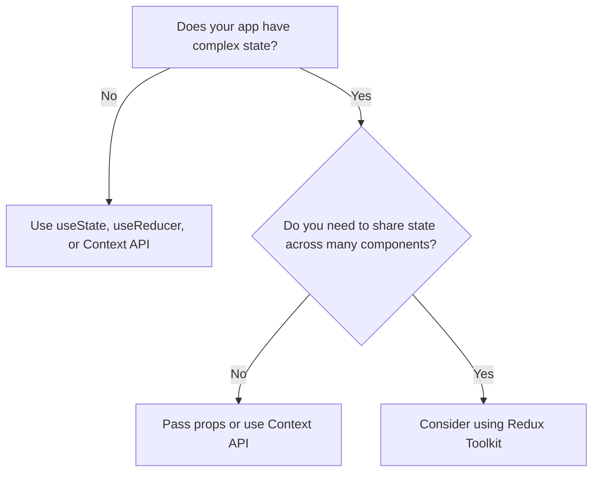
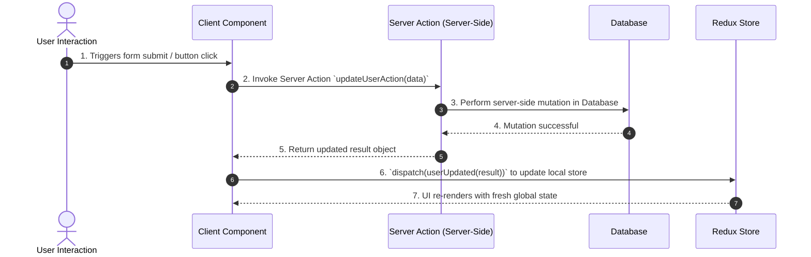
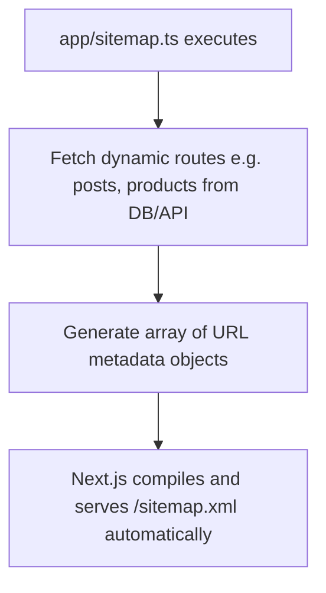

# Next.js Fundamentals Cheatsheet

## 1. What is Next.js?
* A React framework for building full web applications.
* **Key Feature**: **Server-side Rendering (SSR)**. The server generates full HTML, and the browser displays content immediately.
* **Pros**: Great SEO, faster First Contentful Paint.
* **Why Next.js?**
  1. **Hybrid Rendering**: Supports SSR (Server-Side), SSG (Static Site Generation), and CSR (Client-Side).
  2. **File-system Routing**: Folders automatically define routes (no extra setup needed).
  3. **API Routes**: Build backend endpoints within the same project.
  4. **Automatic Optimization**: Built-in optimization for images, fonts, and scripts.

---

## 2. Setup & Installation
* **Prerequisite**: Node.js 18.17 or later.
* **Create a new project**:
  ```bash
  npx create-next-app@latest
  ```
  *(Follow the interactive prompts to configure TypeScript, Tailwind CSS, ESLint, etc.)*
* **Start Development Server**:
  ```bash
  cd my-next-app
  npm run dev
  ```
  *(Runs on `http://localhost:3000`)*

---

## 3. App Router (`app/` directory)
The App Router uses a file-system-based routing model. Folders represent URL segments.

**Special File Conventions**:
* `page.tsx`: The main, unique UI for a specific route.
* `layout.tsx`: Shared UI wrapping multiple pages (e.g., Header, Sidebar).
* `loading.tsx`: Loading UI (uses React Suspense).
* `error.tsx`: Error boundary UI.
* `route.ts`: API endpoints.
* `not-found.tsx`: 404 Not Found UI.
* `metadata.ts`: Manages SEO metadata (title, description).
* `template.tsx`: Similar to layout but re-mounts on navigation.

---

## 4. Layouts & Nested Routing
* Layouts accept a `children` prop.
* They allow creating shared UI elements that **do not re-render** when navigating between child pages.
* Layouts can be nested to create a component hierarchy.
* **Root Layout** (`app/layout.tsx`): Required top-level layout. Must contain `<html>` and `<body>` tags.
* **Nested Layout** (e.g., `app/dashboard/layout.tsx`): Only applies to pages within the `/dashboard` route.

---

## 5. Server vs. Client Components

### Server Components (Default)
* Run **only on the server**.
* **Cannot** use hooks (`useState`, `useEffect`) or browser-only APIs.
* **Best for**: Accessing backend resources directly (Databases, internal APIs), fetching data, and reducing JavaScript bundle size sent to the client.
* All components in the `app/` directory are Server Components by default.

### Client Components
* Require the **`"use client";`** directive at the top of the file.
* Rendered on the server (SSR) and then "hydrated" on the client to become interactive.
* **Best for**: Using hooks, managing state, and handling user events (`onClick`, `onChange`, etc.).

---

## 6. Advanced Routing Techniques

### 1. Dynamic Routes
* Instead of making a separate file for each item, use a template for pages with dynamic data (e.g., blog posts, products).
* Wrap the folder name in square brackets: e.g., `[slug]` or `[userId]`.
* The dynamic value from the URL is passed to the component as a `params` prop.

### 2. Nested Routes and Layouts
* You can nest dynamic routes and layouts to build complex, shared UIs.
* Adding a `layout.tsx` inside a dynamic folder (like `[userId]`) creates a shared UI (e.g., a sidebar) that appears on all sub-pages for that user.

### 3. Catch-all & Optional Catch-all Routes
* **Catch-all Routes (`[...folderName]`)**: Captures all subsequent URL segments.
  * Useful for deep paths like documentation. E.g., `[...slug]` matches `/docs/a` and `/docs/a/b`.
* **Optional Catch-all Routes (`[[...folderName]]`)**: Same as Catch-all, but it **also matches the root path** without any extra segments. 
  * Perfect for optional URL parameters like search filters.

### 4. The `<Link>` Component for Navigation
* The primary way to navigate between pages in Next.js.
* Updates the page content without a full-page reload, making navigation feel instant.
* Next.js automatically **pre-loads** the next page in the background!
* Usage: `<Link href="/path">Click Here</Link>`

### 5. Programmatic Navigation
* Used when you need to redirect a user after an action (like a form submission or login).
* **`useRouter()`**: Hook to trigger navigation via code.
  * Call `router.push('/your-path')`.
  * *Note*: Requires a Client Component (`"use client";`).
* **`usePathname()`**: Hook to get the current URL path string you are on.

---

## 7. Data Fetching Strategies

### 1. The Shift to Server Components
* Previously, React used client-side fetching (`useEffect`), leading to layout shifts and network waterfalls.
* Next.js Server Components fetch data directly on the server **before rendering**.
* **Benefits**: Eliminates client-side processing, hides sensitive API keys, provides fully populated HTML (instant visibility), and ensures superior SEO.
* **Types of Data**:
  * **Static Data**: Fetched once at build time and cached globally (maximum speed).
  * **Dynamic Data**: Fetched on every request (real-time updates).

### 2. Fetching in Server Components (`async/await`)
* By default, all components are Server Components.
* Simply use `async/await` directly inside the component to fetch data.
* Next.js handles the server-side fetch automatically. Recommended for data that doesn't need user interaction.

### 3. Static Generation (`generateStaticParams`)
* **Static Site Generation (SSG)** pre-renders pages at build time.
* For dynamic routes (e.g., `[slug]`), use `generateStaticParams` to tell Next.js which parameters to pre-render.
* It returns an array of `params` objects, generating a static HTML page for each (improves speed and reduces server load).

### 4. Server-Side Rendering (SSR) & Streaming UI
* **SSR**: The default for dynamic pages that aren't statically generated. HTML is generated on the server for *each* request.
* **Streaming UI**: Instead of waiting for the full page to render, Next.js sends a static UI shell (like a layout) with a loading state. As data is fetched, the dynamic content is "streamed" in.
* Achieved using a `loading.tsx` file and React Suspense.

### 5. Client-Side Data Fetching
* Use this for frequently changing data or data depending on user interaction (e.g., a dashboard).
* Requires making the component a Client Component (`"use client";`).
* Can use standard React hooks (`useEffect`, `useState`) or specialized libraries like **SWR** or **React Query** for caching and revalidation.

### 6. Creating API Routes
* Create API endpoints by adding a `route.ts` (or `.js`) file inside a route folder.
* Export async functions named after HTTP methods (`GET`, `POST`, `PUT`, `DELETE`).
* Enables building a full backend directly within your Next.js app to handle client requests or communicate securely with external services.

---

## 8. Performance Optimization Techniques

### 1. Image Optimization with the `<Image>` Component
The Next.js `<Image>` component (`next/image`) is an extension of the HTML `` tag, specifically designed for performance optimization. It automatically performs the following tasks:
* **Resizing**: Creates smaller versions of images for different screen sizes to avoid sending oversized image files to the user's device.
* **Format Optimization**: Automatically converts images to more modern formats like WebP or AVIF (if the browser supports them), which reduces file size while maintaining quality.
* **Lazy Loading**: By default, images are only loaded when they are scrolled into the user's viewport, which speeds up the initial page load.
* **Prevents Cumulative Layout Shift (CLS)**: Automatically sets dimensions for the image so the browser can reserve space for it before it finishes loading, preventing content from suddenly "jumping."

### 2. Code Splitting & Parallel Loading
* **Automatic Code Splitting**: Next.js intelligently performs code splitting out of the box. Each `page.tsx` file in the App Router is compiled into its own JavaScript "bundle." This means that when a user visits a page, they only download the code necessary for that specific page, not the entire application.
* **Parallel Route Loading**: When a URL is requested, Next.js will load all the necessary `layout.tsx` and `page.tsx` files for that route in parallel. For example, when accessing `/dashboard/settings`, the root layout, the dashboard layout, and the settings page will all be fetched and rendered simultaneously on the server, minimizing wait times.
* *Note*: This is an automatic behavior; you don't need any extra configuration. Simply structuring your application according to the App Router conventions enables this feature.

### 3. React Suspense and Lazy Loading with Loading UI
* React Suspense is a React feature that lets components "wait" for something (like data) before they render. Next.js deeply integrates with Suspense to create a better user experience through **Streaming**.
* By creating a `loading.tsx` file, you are telling Next.js: "While the main page component (`page.tsx`) is busy fetching data, show the UI from this `loading.tsx` file as a temporary placeholder." This allows the user to immediately see part of the page and know that content is on its way, instead of staring at a blank screen.

### 4. Caching Strategies and ISR
Next.js extends JavaScript's `fetch` function with a powerful server-side caching system.
* **Static Fetch (Default)**: `fetch('...')` will automatically cache the result indefinitely. This is similar to `getStaticProps` in the Pages Router. The data is fetched at build time and reused for every request.
* **No-cache Fetch**: `fetch('...', { cache: 'no-store' })` will always fetch fresh data for every request. This is similar to `getServerSideProps`.
* **Incremental Static Regeneration (ISR)**: `fetch('...', { next: { revalidate: 60 } })` is the best of both worlds. It caches data for a specific time period (e.g., 60 seconds). The first request within that window gets the cached data, while Next.js triggers a "revalidation" in the background to fetch fresh data. Subsequent requests will receive the updated data.

### 5. Monitoring and Improving Core Web Vitals
Core Web Vitals (CWV) are a set of three metrics from Google used to measure real-world user experience on a website, focusing on loading speed, interactivity, and visual stability.
1. **Largest Contentful Paint (LCP)**: Measures the time it takes for the largest content element (usually an image or text block) to become visible. Next.js helps improve LCP with the `<Image>` component.
2. **Interaction to Next Paint (INP)**: Measures the latency from a user interaction (click, tap, key press) until the UI provides feedback. Next.js helps improve INP with code splitting, loading only necessary JS. (INP has replaced First Input Delay - FID).
3. **Cumulative Layout Shift (CLS)**: Measures how much the layout "jumps" unexpectedly during loading. Next.js helps reduce CLS by automatically sizing images and fonts.

You can monitor these metrics using tools like Google PageSpeed Insights or by integrating Vercel Analytics into your project.

**Metrics Diagram**:
* **LCP (Loading)**: "Does the page load fast?" -> `<Image>`, Font Optimization.
* **INP (Interactivity)**: "Does the page respond quickly?" -> Code Splitting.
* **CLS (Stability)**: "Is the layout stable?" -> `<Image>`, Font Optimization.

---

## 9. Styling and CSS in Next.js

### 1. Using CSS Modules
CSS Modules are a way to write CSS that is locally scoped to a specific component. When you import a CSS Module file, Next.js automatically generates unique classnames, which helps you avoid class name conflicts between different components. This is the built-in and recommended way to handle component-level styling in Next.js. To use it, you just need to name your file with the `[name].module.css` convention.

### 2. Example

#### 1. CSS Module File (`Button.module.css`)
```css
/* app/components/Button.module.css */
.btn {
  background-color: blue;
  color: white;
  padding: 10px 20px;
  border-radius: 5px;
}
```

#### 2. Using it in a Component (`Button.tsx`)
```tsx
// app/components/Button.tsx
import styles from './Button.module.css';

export default function Button() {
  return (
    <button className={styles.btn}>Click me!</button>
  );
}
```

### 3. Integrating Sass/SCSS
Sass/SCSS is a CSS preprocessor that extends the capabilities of CSS with features like:
* **Variables**: To store reusable values (colors, font sizes).
* **Nesting**: Write CSS rules nested within each other, following the HTML structure.
* **Mixins**: Create reusable blocks of styles.
* **Partials & Imports**: Split CSS into manageable modules.

**Installation**:
```bash
npm install sass
# or
yarn add sass
```

### 4. Sass/SCSS - Example
```
app/
├── styles/
│   └── _variables.scss  // File for global variables
└── components/
    ├── Card.jsx
    └── Card.module.scss // Using SCSS for the module
```

`app/styles/_variables.scss`
```scss
// Define global variables
$primary-color: #8a2be2;
$border-radius: 12px;
$card-shadow: 0 4px 12px rgba(0, 0, 0, 0.1);
```

`app/components/Card.module.scss`
```scss
// Import variables from the partial file
@import '../styles/variables';

.card {
  padding: 1.5rem;
  border-radius: $border-radius;
  box-shadow: $card-shadow;
  background-color: white;

  h3 {
    margin-top: 0;
    color: $primary-color;
  }

  p {
    color: #555;
  }
}
```

`app/components/Card.jsx`
```jsx
// Usage is no different from regular CSS Modules
import styles from './Card.module.scss';

export default function Card({ title, content }) {
  return (
    <div className={styles.card}>
      <h3>{title}</h3>
      <p>{content}</p>
    </div>
  );
}
```

### 5. Styled-components with Server Components
Styled-components is a CSS-in-JS library that allows you to write CSS directly in your JavaScript/TypeScript files using tagged template literals.
* **Advantages**: Dynamic styling based on props, automatic scoping, no need to worry about class names.

**Challenge with the App Router**: Styled-components requires a browser runtime environment to inject styles into the DOM. However, Server Components are rendered entirely on the server, where this environment doesn't exist.

**Solution**:
1. All components using styled-components must be Client Components (marked with `'use client'`).
2. A Style Registry needs to be created to collect all the styles generated during the server render, and then inject them into the `<head>` of the HTML file sent to the client.

### 6. Styled-components - Installation & Example
**Install the library**:
```bash
npm install styled-components
```

**Create the file** `app/lib/StyledComponentsRegistry.jsx`:
```jsx
'use client'

import React, { useState } from 'react'
import { useServerInsertedHTML } from 'next/navigation'
import { ServerStyleSheet, StyleSheetManager } from 'styled-components'

export default function StyledComponentsRegistry({ children }) {
  const [styledComponentsStyleSheet] = useState(() => new ServerStyleSheet())

  useServerInsertedHTML(() => {
    const styles = styledComponentsStyleSheet.getStyleElement()
    styledComponentsStyleSheet.instance.clearTag()
    return <>{styles}</>
  })

  if (typeof window !== 'undefined') return <>{children}</>

  return (
    <StyleSheetManager sheet={styledComponentsStyleSheet.instance}>
      {children}
    </StyleSheetManager>
  )
}
```

### 7. Installation & Example (cont.)
**3. Use the Registry in the Root Layout (`app/layout.jsx`)**:
```jsx
import StyledComponentsRegistry from './lib/StyledComponentsRegistry';

export default function RootLayout({ children }) {
  return (
    <html>
      <body>
        <StyledComponentsRegistry>{children}</StyledComponentsRegistry>
      </body>
    </html>
  );
}
```

`app/components/StyledButton.jsx`
```jsx
'use client'; // MUST be a Client Component

import styled from 'styled-components';

// Dynamic style based on the 'primary' prop
const Button = styled.button`
  background: ${props => props.$primary ? '#BF4F74' : 'white'};
  color: ${props => props.$primary ? 'white' : '#BF4F74'};
  font-size: 1em;
  margin: 1em;
  padding: 0.5em 1.5em;
  border: 2px solid #BF4F74;
  border-radius: 5px;
  cursor: pointer;
`;

export default function StyledButton({ primary, children }) {
  // Note: styled-components recommends using props with a $ prefix
  // to avoid them being passed down to the DOM element unnecessarily.
  return <Button $primary={primary}>{children}</Button>
}
```

### 8. Tailwind CSS in the App Router
Tailwind CSS is a utility-first framework. Instead of writing custom CSS, you build interfaces by applying pre-existing utility classes directly in your JSX.
* **Advantages**: Extremely fast UI development, consistent, easily customizable, and automatically purges unused CSS for production optimization.

**Installation & Configuration**: (According to the official Tailwind documentation)
1. **Install necessary packages**:
```bash
npm install -D tailwindcss postcss autoprefixer
```
2. **Initialize configuration files**:
```bash
npx tailwindcss init -p
```

### 9. Adding Custom Tailwind CSS Classes
To maintain a consistent design system, you'll often need to add custom values (like brand colors, fonts, or animations) to Tailwind. This is done in the `tailwind.config.ts` file.

The best practice is to add your customizations inside the `theme.extend` object. This adds to Tailwind's default theme instead of completely replacing it. Once defined, you can use these classes anywhere in your application.

---

## 10. State Management in Next.js Applications

### 1. Overview - Challenges in Next.js
In the Next.js App Router, state management is more complex due to the separation between Server and Client.
* **Server Components**:
  * Run on the server, are stateless, and cannot use hooks like `useState` or `useEffect`.
  * Ideal for data fetching and accessing the backend.
  * Cannot directly interact with client-side state.
* **Client Components** (`"use client"`):
  * Behave like traditional React components.
  * Can use hooks, manage state, and handle events.
  * All state management libraries (Context, Redux, Zustand) must be used within Client Components.
* **Hydration**:
  * The process of 'breathing life' into static server-rendered HTML by attaching JavaScript event listeners and state on the client, making the page interactive.
  * Synchronizing the initial state between the server and client is crucial to avoid errors.

### 2. React Context & Server Components
The React Context API is a way to share state between components without having to pass props down through multiple levels (prop drilling).
* **Pros**:
  * Built into React, no extra libraries needed.
  * Easy to learn and use for small to medium-sized applications.
  * Excellent for state that changes infrequently, like themes (light/dark mode), language, or user information.
* **Cons**:
  * Can cause unnecessary re-renders for all consuming components when the state changes.
  * Not optimized for frequent and complex state updates.
* **Note in Next.js**:
  * The Context Provider MUST be placed within a Client Component (`"use client"`).

**Flow**:
1. RootLayout (Server) renders the ThemeProvider.
2. ThemeProvider (Client) creates the state and provides it via the Context.
3. The children (which can be Server or Client Components) are rendered inside the Provider.
4. Only Client Components within the tree can access the state from the Context (e.g., ThemeToggleButton).

**Example**:
```jsx
// contexts/ThemeContext.jsx
'use client';

import { createContext, useState, useContext } from 'react';

// Create Context
const ThemeContext = createContext();

// Create Provider Component
export function ThemeProvider({ children }) {
  const [theme, setTheme] = useState('light');

  const toggleTheme = () => {
    setTheme((prevTheme) => (prevTheme === 'light' ? 'dark' : 'light'));
  };

  return (
    <ThemeContext.Provider value={{ theme, toggleTheme }}>
      {children}
    </ThemeContext.Provider>
  );
}

// Create a custom hook for easy consumption
export function useTheme() {
  return useContext(ThemeContext);
}
```

```jsx
// app/layout.js
import { ThemeProvider } from '@/contexts/ThemeContext';

export default function RootLayout({ children }) {
  return (
    <html lang="en">
      <body>
        <ThemeProvider>{children}</ThemeProvider>
      </body>
    </html>
  );
}
```

```jsx
// components/ThemeSwitcher.jsx
'use client';

import { useTheme } from '@/contexts/ThemeContext';

export default function ThemeSwitcher() {
  const { theme, toggleTheme } = useTheme();

  return (
    <button onClick={toggleTheme} className={`p-2 rounded ${theme === 'light' ? 'bg-gray-800 text-white' : 'bg-white text-black'}`}>
      Switch to {theme === 'light' ? 'Dark' : 'Light'} Mode
    </button>
  );
}
```

### 3. Redux Toolkit & App Router
Redux Toolkit (RTK) is the official, recommended toolset for writing Redux logic. It simplifies store setup and reducer creation.
* **Pros**:
  * Centralized, predictable state management.
  * Powerful ecosystem (DevTools, middleware like Redux Thunk/Saga).
  * Performance optimizations with reselect and Immer.
  * Suitable for large, complex applications with a lot of global state.
* **Cons**:
  * Still has some boilerplate (though significantly reduced by RTK).
  * Steeper learning curve compared to other solutions.
* **Note in Next.js**: Similar to Context, the Redux store only exists on the client side. The Provider must also be placed in a Client Component.

**Flow**:
1. The store is created once on the client side.
2. The `StoreProvider` (Client) provides this store to the component tree.
3. Child Client Components can interact with the store using the `useDispatch` and `useSelector` hooks.

```
(Server) RootLayout
└── (Client) "use client" <StoreProvider>
    └── (Server) {children} - (e.g., DashboardPage)
        └── (Client) "use client" <CounterComponent />
```

**1. Installation**:
```bash
npm install @reduxjs/toolkit react-redux
```

**2. Create a Slice (`/lib/features/counter/counterSlice.js`)**:
```javascript
import { createSlice } from '@reduxjs/toolkit';

const initialState = { value: 0 };

const counterSlice = createSlice({
  name: 'counter',
  initialState,
  reducers: {
    increment: (state) => {
      state.value += 1;
    },
    decrement: (state) => {
      state.value -= 1;
    },
  },
});

export const { increment, decrement } = counterSlice.actions;
export default counterSlice.reducer;
```

**3. Create the Store (`/lib/store.js`)**:
```javascript
import { configureStore } from '@reduxjs/toolkit';
import counterReducer from './features/counter/counterSlice';

export const makeStore = () => {
  return configureStore({
    reducer: {
      counter: counterReducer,
    },
  });
};
```

**4. Create the Provider (`/app/StoreProvider.jsx`)**:
```jsx
'use client';

import { useRef } from 'react';
import { Provider } from 'react-redux';
import { makeStore } from '../lib/store';

export default function StoreProvider({ children }) {
  const storeRef = useRef(null);
  if (!storeRef.current) {
    // Create a new store instance the first time this renders
    storeRef.current = makeStore();
  }

  return <Provider store={storeRef.current}>{children}</Provider>;
}
```

**5. Use in `layout.js` and a component**:
```jsx
// app/layout.js
import StoreProvider from './StoreProvider';

export default function RootLayout({ children }) {
  return (
    <html lang="en">
      <body>
        <StoreProvider>{children}</StoreProvider>
      </body>
    </html>
  );
}
```

```jsx
// components/Counter.js
'use client';
import { useSelector, useDispatch } from 'react-redux';
import { increment, decrement } from '@/lib/features/counter/counterSlice';

export function Counter() {
  const count = useSelector((state) => state.counter.value);
  const dispatch = useDispatch();

  return (
    <div>
      <button onClick={() => dispatch(decrement())}>-</button>
      <span>{count}</span>
      <button onClick={() => dispatch(increment())}>+</button>
    </div>
  );
}
```

### 4. Recoil & Zustand
These are modern, minimalist, hook-based state management libraries.

**Zustand**
* **'Zustand'** means 'state' in German.
* Extremely simple with minimal boilerplate.
* State is stored in a store outside of React, accessed via hooks.
* No need to wrap the application in a Provider.
* **Best for**: Projects of all sizes that need a lightweight, easy-to-use solution.

**Recoil**
* Developed by Facebook.
* Uses the concepts of 'atoms' (individual units of state) and 'selectors' (derived state).
* Allows for better re-render optimization as components subscribe only to the atoms they need.
* **Best for**: Complex applications that need to efficiently manage interdependent states. Requires a Provider (`RecoilRoot`).

**Persist State**
The fundamental problem that state persistence solves is the temporary nature of state held in memory. By default, when you create state with Zustand (or any other state management library), it's stored in the browser's JavaScript memory. This means:
* When a user reloads the page (F5), all JavaScript memory is wiped clean and re-initialized.
* When a user closes the tab or browser, that memory is completely destroyed.

As a result, the application's entire state reverts to its initial value. This creates a very poor user experience in many common scenarios, for example:
* **Shopping Cart**: A customer adds five items to their cart, accidentally reloads the page, and finds their cart is completely empty.
* **User Preferences**: A user selects dark mode, but when they return to the site later, the interface has reverted to light mode.
* **Form Data**: A user is filling out a long form, but accidentally closes the tab and has to start all over from scratch.

State persistence is the solution to this problem. It takes state from temporary memory and saves it to a more durable storage location on the user's device.

**Configuring State Persistence with Zustand**:
1. **Create the Persisted Store**: Use the `persist` middleware and provide a unique name to act as the key in localStorage. This automatically saves and rehydrates your state. (`stores/settingsStore.ts`)
2. **Handle Hydration in Next.js / SSR**: Delay rendering UI that uses the store until the component has mounted on the client. This prevents a "hydration mismatch" error between the server and client. (`components/ThemeSwitcher.tsx`)

### 5. Handling State Hydration
Hydration is the process where client-side React takes over the HTML rendered by the server.

**The Problem**: If the initial state on the client does not match what was rendered on the server, React will throw a "Hydration Mismatch" error.
* **Example**: The server renders a page with a 'light' theme, but the client initializes the theme state as 'dark' (e.g., from localStorage).

**The Solution**: Pass the initial state from a Server Component down to a Client Component as props. The Client Component will use these props to initialize its state, ensuring consistency.

**Correct Hydration Flow Diagram**:
1. **Server**: ServerComponent fetches data (`initialTodos`).
2. **Server -> Client**: Pass `initialTodos` via props to ClientComponent.
3. **Client**: ClientComponent receives `initialTodos` and uses it as the initial value for `useState`. `const [todos, setTodos] = useState(initialTodos)`.
4. **Result**: The server-rendered HTML and the initial client-side state match. Hydration succeeds!

---

## 11. Authentication & Authorization

### 1. Overview: Core Concepts
**Authentication**
* **What is it?** Answers the question: "Who are you?"
* **Purpose**: To verify a user's identity, typically via username/password, social accounts, etc.
* **Example**: Logging into Gmail.

**Authorization**
* **What is it?** Answers the question: "What are you allowed to do?"
* **Purpose**: To determine the access rights of an authenticated user.
* **Example**: Only an admin can access the admin dashboard.

### 2. Setting Up NextAuth.js in the App Router
NextAuth.js (Auth.js) is the most comprehensive and popular solution for authentication in Next.js.
**Advantages**:
* Supports multiple "Providers" (Google, GitHub, credentials...).
* Easy to set up, minimizing boilerplate code.
* Automatically manages sessions and secure cookies.
* Deeply integrated with Next.js (both Pages and App Router).

**Flow**:
```
participant User
participant Client as Browser (Next.js App)
participant Server as Next.js Server (Route Handler)
participant Provider as Google/GitHub

User->>Client: 1. Clicks "Sign in with Google"
Client->>Server: 2. Calls signIn('google')
Server->>Provider: 3. Redirects to Google sign-in page
Provider-->>User: 4. Requests authentication
User->>Provider: 5. Signs in successfully
Provider-->>Server: 6. Sends back authorization code
Server->>Provider: 7. Exchanges code for access token
Server->>Server: 8. Creates session & saves to cookie
Server-->>Client: 9. Returns session to client
Client-->>User: 10. Displays "Signed in" status
```

### 3. Example: Setting up NextAuth.js

**1. Installation**:
```bash
npm install next-auth
```

**2. Create Route Handler**: `app/api/auth/[...nextauth]/route.ts`
```typescript
// app/api/auth/[...nextauth]/route.ts
import NextAuth from "next-auth"
import GoogleProvider from "next-auth/providers/google"
import CredentialsProvider from "next-auth/providers/credentials";

const handler = NextAuth({
  providers: [
    GoogleProvider({
      clientId: process.env.GOOGLE_CLIENT_ID!,
      clientSecret: process.env.GOOGLE_CLIENT_SECRET!,
    }),
    CredentialsProvider({
      // ... configuration for username/password login
    })
  ],
  pages: { signIn: '/login' }, // Custom sign-in page
})

export { handler as GET, handler as POST }
```

**3. Using the Session in a Component**:
```tsx
// components/SomeComponent.tsx (Server Component)
import { auth } from "@/auth" // Assuming auth.ts is the config file

export default async function SomeComponent() {
  const session = await auth(); // Get session on the server
  if (session) {
    return <p>Signed in as {session.user?.email}</p>
  }
  return <p>Not signed in</p>
}
```

### 4. Building a Custom Auth with Server Actions
For cases where you want full control over the authentication logic.
**When to use it?**
* Proprietary authentication systems, not using OAuth.
* Need deep integration with an existing database.
* Don't want to depend on a third-party library.

**Approach**:
* A login form calls a Server Action.
* The Server Action handles logic: checks DB, hashes passwords.
* On success, create a session (e.g., using iron-session) and save it in a secure (httpOnly) cookie.

**Custom Auth Flow with Server Actions**:


**Example: Custom Auth with Server Actions**
Use a library like `jose` to create a JWT or `iron-session` to encrypt the cookie.

```typescript
// app/login/actions.ts
'use server'

import { sealData } from 'iron-session/edge';
import { cookies } from 'next/headers';
import { redirect } from 'next/navigation';

export async function login(formData: FormData) {
  const email = formData.get('email');
  // 1. Get user from DB
  // const user = await getUserByEmail(email);

  // 2. Verify password (e.g., using bcrypt.compare)
  // const isValid = await compare(password, user.password);

  // Assume successful authentication
  const user = { id: 1, email, isAdmin: true };

  // 3. Create a secure session
  const session = await sealData(user, {
    password: process.env.SECRET_COOKIE_PASSWORD!,
  });

  // 4. Set the cookie
  cookies().set('session', session, {
    httpOnly: true,
    secure: process.env.NODE_ENV === 'production',
    maxAge: 60 * 60 * 24 * 7, // 1 week
    path: '/',
  });

  // 5. Redirect
  redirect('/dashboard');
}
```

### 5. Implementing JWT Authentication & Secure APIs
* **JWT (JSON Web Token)** is an encoded JSON string used to securely exchange information between parties.
* **Structure**: Header, Payload (data), Signature. The signature ensures the token hasn't been tampered with.
* **Application**: Ideal for protecting API Routes or Route Handlers in Next.js. The client sends the JWT with each request to prove it's authenticated.

**API Security Flow with JWT**:
```
participant Client
participant API as Next.js API Route
participant AuthServer as Server (Login)

Client->>AuthServer: 1. Login (username, password)
AuthServer-->>Client: 2. Returns JWT
Client->>Client: 3. Store JWT (localStorage/cookie)

loop For each request to a protected API
    Client->>API: 4. Send request + JWT in Header (Authorization: Bearer <token>)
    API->>API: 5. Verify JWT signature
    alt Signature valid
        API-->>Client: 6a. Return data successfully
    else Signature invalid/expired
        API-->>Client: 6b. Return 401 Unauthorized error
    end
end
```

**Example: Protecting an API Route Handler**:
```typescript
// app/api/secure-data/route.ts
import { NextRequest, NextResponse } from 'next/server';
import { jwtVerify } from 'jose';

const JWT_SECRET = new TextEncoder().encode(process.env.JWT_SECRET!);

export async function GET(req: NextRequest) {
  const authHeader = req.headers.get('authorization');

  if (!authHeader || !authHeader.startsWith('Bearer ')) {
    return NextResponse.json({ message: 'Unauthorized' }, { status: 401 });
  }

  const token = authHeader.split(' ')[1];

  try {
    // Verify the token
    const { payload } = await jwtVerify(token, JWT_SECRET);
    console.log('JWT Payload:', payload);

    // Logic to execute when the token is valid
    return NextResponse.json({
      data: `Secret data for user ID: ${payload.sub}`,
    });
  } catch (error) {
    // Token is invalid or has expired
    return NextResponse.json({ message: 'Invalid token' }, { status: 401 });
  }
}
```

### 6. Role-Based Access Control (RBAC)
RBAC is a method of restricting system access for authenticated users based on their roles (e.g., admin, editor, user).
How to implement in Next.js:
* **Middleware (`middleware.ts`)**: Acts as a "gatekeeper". It runs before a request is processed. Ideal for checking roles and redirecting if unauthorized.
* **Layouts**: Apply to a group of routes. Can be used to wrap pages that require specific permissions, show different UIs, or check permissions at the layout level.

**Authorization Flow with Middleware**:


**Example: Authorization with Middleware**:
```typescript
// middleware.ts (place in the root directory)
import { NextResponse } from 'next/server';
import type { NextRequest } from 'next/server';
import { getIronSession } from 'iron-session/edge';

export async function middleware(req: NextRequest) {
  const res = NextResponse.next();
  const session = await getIronSession(req, res, {
    cookieName: 'session',
    password: process.env.SECRET_COOKIE_PASSWORD!,
  });

  const { user } = session;

  // If accessing an admin page but is not an admin
  if (req.nextUrl.pathname.startsWith('/admin') && user?.isAdmin !== true) {
    return NextResponse.redirect(new URL('/', req.url)); // Redirect to home page
  }

  // If not logged in but accessing a protected page
  if (req.nextUrl.pathname.startsWith('/dashboard') && !user) {
    return NextResponse.redirect(new URL('/login', req.url));
  }

  return res;
}

export const config = {
  matcher: ['/admin/:path*', '/dashboard/:path*'], // Routes to apply the middleware to
};
```

---

## 12. Testing Next.js Applications

### 1. Introduction & Objectives
**Why is Testing Important?**
* **Ensure Quality**: Detect bugs early, before they reach the user.
* **Increase Confidence**: Be more confident when refactoring code or adding new features.
* **Living Documentation**: Tests act as documentation describing how the code works.
* **Improve Architecture**: Writing testable code often leads to better application architecture.

**Agenda**
1. Unit Testing: With Jest for Server & Client Components.
2. Integration Testing: With React Testing Library.
3. End-to-End Testing: Using Cypress.
4. Testing the Backend: API Routes & Server Actions.

### 2. The Testing Pyramid
The Testing Pyramid is a model that helps visualize different levels of testing and their recommended proportions.
**Visual**: Imagine a pyramid with three levels.
* **Bottom (Widest)**: Unit Tests (Most numerous, fast, cheap)
* **Middle**: Integration Tests
* **Top (Smallest)**: End-to-End (E2E) Tests (Fewest, slow, expensive)

* **Unit Tests** (Most numerous): Test the smallest units of code (functions, components) in isolation. Very fast and low cost.
* **Integration Tests** (Moderate amount): Test the interaction between multiple units.
* **E2E Tests** (Fewest): Test the entire application flow from start to finish, simulating real user behavior. Slow and high cost.

### 3. Unit Testing with Jest
* **Objective**: Test a component or function individually, isolated from other parts of the application.
* **Tools**:
  * **Jest**: A powerful and easy-to-set-up JavaScript testing framework.
  * **React Testing Library (RTL)**: Provides utilities to render components and interact with them the way a user would.

**Unit Test Workflow**
`Test File` → `Jest Runner` → `Render Component` → `Simulate Interaction` → `Assert Result`

#### 3.1. Unit Testing - Client Component Example

**Component to test (`Counter.tsx`)**:
```tsx
'use client';
import { useState } from 'react';

export default function Counter() {
  const [count, setCount] = useState(0);
  return (
    <div>
      <p>Count: {count}</p>
      <button onClick={() => setCount(count + 1)}>Increment</button>
    </div>
  );
}
```

**Test File (`Counter.test.tsx`)**:
```tsx
import { render, screen, fireEvent } from '@testing-library/react';
import Counter from './Counter';

describe('Counter Component', () => {
  it('should render initial count and increment on click', () => {
    // 1. Render component
    render(<Counter />);

    // 2. Find elements on the DOM
    const countElement = screen.getByText(/Count: 0/i);
    const button = screen.getByRole('button', { name: /Increment/i });

    // 3. Assertion: Check the initial state
    expect(countElement).toBeInTheDocument();

    // 4. Action: Simulate a user click event
    fireEvent.click(button);
  });
});
```

#### 3.2. Unit Testing - Server Component Example

**Component to test (`UserProfile.tsx`)**:
```tsx
// Server Component without 'use client'
type User = { id: number; name: string; email: string };

export default async function UserProfile({ userId }: { userId: number }) {
  // Assume this function fetches data from an API
  const fetchUser = async (id: number): Promise<User> => {
    return { id, name: 'Leanne Graham', email: 'Sincere@april.biz' };
  };

  const user = await fetchUser(userId);

  return (
    <div>
      <h1>{user.name}</h1>
      <p>{user.email}</p>
    </div>
  );
}
```

**Test File (`UserProfile.test.tsx`)**:
*Note: We are not testing the data fetching, only that the UI renders correctly with the provided data.*
```tsx
import { render, screen } from '@testing-library/react';
// Server component needs to be rendered in the test environment
import UserProfile from './UserProfile';

// TypeScript will error because we are passing an async component to render.
// To solve this, we can use a small trick.
const Resolved = async ({ children }: { children: React.ReactNode }) => await children;

describe('UserProfile Server Component', () => {
  it('renders user data correctly', async () => {
    // Render the async component
    render(<Resolved><UserProfile userId={1} /></Resolved>);

    // Wait and find the elements
    const nameElement = await screen.findByRole('heading', { name: /Leanne Graham/i });
    const emailElement = await screen.findByText(/Sincere@april.biz/i);

    // Assertion
    expect(nameElement).toBeInTheDocument();
    expect(emailElement).toBeInTheDocument();
  });
});
```

### 4. Integration Testing with React Testing Library
**Objective**: Test how multiple components work together as a complete functional block. For example: a form and the success message after submission.
**Tools**: Still Jest and React Testing Library.
**Difference from Unit Test**: Instead of rendering a single component, we render a group of components (often an entire page) and test the interaction flow between them.

**Integration Test Workflow**
`Test File` → `Render Page (with multiple components)` → `Simulate User Flow` → `Assert Final State`

#### 4.1 Integration Testing - Example

**Components to test (`NewsletterForm.tsx` and `page.tsx`)**:
```tsx
// NewsletterForm.tsx
'use client';

export default function NewsletterForm({ setSuccess }: { setSuccess: (success: boolean) => void }) {
  const handleSubmit = (e: React.FormEvent) => {
    e.preventDefault();
    setSuccess(true);
  };
  return (
    <form onSubmit={handleSubmit}>
      <input type="email" placeholder="Enter your email" required />
      <button type="submit">Subscribe</button>
    </form>
  );
}
```

```tsx
// page.tsx
'use client';
import { useState } from 'react';
import NewsletterForm from './NewsletterForm';

export default function Home() {
  const [success, setSuccess] = useState(false);
  return (
    <main>
      <h1>Join our Newsletter</h1>
      {success ? (
        <p>Thank you for subscribing!</p>
      ) : (
        <NewsletterForm setSuccess={setSuccess} />
      )}
    </main>
  );
}
```

**Test File (`Home.test.tsx`)**:
```tsx
import { render, screen, fireEvent } from '@testing-library/react';
import Home from './page';

describe('Newsletter Subscription Flow', () => {
  it('shows a success message after form submission', () => {
    render(<Home />);

    // Find the input and button
    const emailInput = screen.getByPlaceholderText(/enter your email/i);
    const subscribeButton = screen.getByRole('button', { name: /subscribe/i });

    // Fill the form and submit
    fireEvent.change(emailInput, { target: { value: 'test@example.com' } });
    fireEvent.click(subscribeButton);

    // Check that the success message appears
    const successMessage = screen.getByText(/Thank you for subscribing!/i);
    expect(successMessage).toBeInTheDocument();

    // (Optional) Check that the form has disappeared
    expect(emailInput).not.toBeInTheDocument();
  });
});
```

### 5. End-to-End (E2E) Testing with Cypress
* **Objective**: Simulate a real user, testing the entire application from the user interface (frontend) to the server (backend) in a real browser.
* **Tool**: Cypress.
* **Advantages**: Comprehensively tests the most critical flows (registration, payment, etc.). Ensures all parts of the system work well together.

**E2E Test Workflow**
`Cypress Runner` → `Controls Real Browser` → `Visits Page` → `Clicks, Types, Interacts` → `Asserts Content on Page`

#### 5.1 E2E Testing - Example
```typescript
// cypress/e2e/navigation.cy.ts

describe('Page Navigation', () => {
  it('should navigate from home to the about page', () => {
    // 1. Start from the home page
    cy.visit('http://localhost:3000/');

    // 2. Find a link with an href containing 'about' and click it
    cy.get('a[href*="about"]').click();

    // 3. The new URL should include '/about'
    cy.url().should('include', '/about');

    // 4. The new page should have an h1 heading containing "About Us"
    cy.get('h1').contains('About Us');
  });
});
```
**How to run**:
1. Start the Next.js dev server: `npm run dev`
2. Open Cypress: `npx cypress open`
3. Select the test file and watch it run live in the browser.

### 6. Testing API Routes & Server Actions
* **Objective**: Test the backend logic of Next.js without going through the UI.
* **Methods**:
  * **API Routes**: Directly call the handler function with mocked `req` and `res` objects.
  * **Server Actions**: Since they are just async functions, we can import and call them directly in the test.
* **Tools**: Jest and the `node-mocks-http` library to mock requests/responses.

**API Route Test Workflow**
`Test File` → `Calls API Handler` → `Provide Mock Request` → `Assert Mock Response (status, body)`

#### Testing - API Route Example

**API Route to test (`/api/hello/route.ts`)**:
```typescript
// app/api/hello/route.ts
import { NextResponse } from 'next/server';

export async function GET(request: Request) {
  return NextResponse.json({ message: 'Hello, World!' });
}
```

**Test File (`hello.test.ts`)**:
```typescript
import { GET } from '@/app/api/hello/route';
import { NextRequest } from 'next/server';

describe('API Route: /api/hello', () => {
  it('should return a hello world message', async () => {
    // Mock a simple NextRequest
    const request = new NextRequest('http://localhost/api/hello');

    // Call the handler function
    const response = await GET(request);

    // Get the JSON data from the response
    const body = await response.json();

    // Assertion
    expect(response.status).toBe(200);
    expect(body).toEqual({ message: 'Hello, World!' });
  });
});
```

#### Testing - Server Action Example

**Server Action to test (`actions.ts`)**:
```typescript
'use server';

// Assume this is a function that interacts with a database
const db = {
  items: [] as string[],
  addItem: async (item: string) => {
    db.items.push(item);
    return { success: true };
  },
};

export async function createItem(formData: FormData) {
  const item = formData.get('item')?.toString();

  if (!item) {
    return { success: false, error: 'Item is required' };
  }

  return await db.addItem(item);
}
```

**Test File (`actions.test.ts`)**:
```typescript
import { createItem } from './actions';

describe('Server Action: createItem', () => {
  it('should return an error if item is missing', async () => {
    const formData = new FormData(); // Empty FormData
    const result = await createItem(formData);

    expect(result).toEqual({ success: false, error: 'Item is required' });
  });

  it('should add an item successfully', async () => {
    const formData = new FormData();
    formData.append('item', 'New Test Item');

    const result = await createItem(formData);

    expect(result).toEqual({ success: true });
  });
});
```

---

## 13. Deploying & Hosting Next.js Applications

### 1. Deploying App Router Projects to Vercel

#### What is Vercel?
* **Vercel** is the cloud platform created by the creators and maintainers of Next.js.
* It provides managed infrastructure that is purpose-built and perfectly optimized for Next.js applications.

#### Why Choose Vercel?
* **Zero-Configuration**: No complex setup needed; Vercel automatically detects, builds, and configures Next.js projects.
* **Performance Optimization**: Automatically applies industry best practices (Global Edge Network / CDN, smart caching, automatic image optimization).
* **Full App Router Support**: Built-in, first-class support for latest features such as Server Components, Server Actions, Route Handlers, and Streaming.
* **Seamless Git Integration**: Automatically triggers CI/CD builds and deployments every time you push code to GitHub, GitLab, or Bitbucket.

#### 1.1 Vercel Deployment Process Diagram



**Deployment Flow**:
`Developer (Writes code & git push)` → `GitHub (Triggers Webhook)` → `Vercel (Builds with next build)` → `Global CDN (Deploys)` → `End-User (Fastest access)`

#### 1.2 Steps to Deploy on Vercel (Step-by-Step Guide)
1. **Push code to a Git Provider**:
   * Ensure your Next.js project is pushed to a remote repository on **GitHub**, **GitLab**, or **Bitbucket**.
2. **Sign up / Log in to Vercel**:
   * Go to [vercel.com](https://vercel.com) and log in with your Git provider account.
3. **Import Project**:
   * From the Vercel dashboard, select **"Add New... -> Project"**.
   * Choose your Next.js repository and click **"Import"**.
4. **Configure (Optional)**:
   * Vercel auto-detects the framework (Next.js), build command (`next build`), and output directory.
   * Add **Environment Variables** if needed (e.g., `DATABASE_URL`, `API_KEY`, `NEXT_PUBLIC_API_URL`).
5. **Deploy**:
   * Click the **"Deploy"** button. Vercel will start the build and deployment process.
   * After a few minutes, your application will have a public URL and be live!

---

### 2. CI/CD with Netlify and Other Platforms

#### What is CI/CD?
* **Continuous Integration (CI)**: Frequently merging new code into the main branch. Each integration is verified by an automated build and test run.
* **Continuous Deployment (CD)**: Automatically deploying every change that passes the CI stage to the production environment.

#### Why Use CI/CD?
* **Minimize Human Error**: Eliminates manual deployment mistakes.
* **Increase Release Velocity**: Speeds up product releases with predictable cycles.
* **Consistent and Reliable Process**: Standardized testing and deployment pipeline.
* **Popular Platforms**: Netlify, AWS Amplify, Google Firebase Hosting, Azure Static Web Apps, Render.

#### 2.1 CI/CD Process Diagram with Netlify



1. **Push to `main` branch**:
   * A developer pushes code to the main branch → Triggers **Deploy to Production**.
2. **Create Pull Request (PR)**:
   * A developer creates a Pull Request for code review → Triggers **Deploy Preview**. Netlify/Vercel creates a preview version of the site with the changes from that PR (extremely useful for testing before merging).

#### 2.2 Example: Configuration for Netlify Deployment

1. **Connect similarly to Vercel**: Log in to Netlify with your Git account and import your repository.
2. **Configure Build**:
   * **Build command**: `next build`
   * **Publish directory**: `.next`
3. **Use the `netlify.toml` configuration file (Recommended)**:
   * Create a `netlify.toml` file in your project's root directory to manage the build configuration explicitly.

**`netlify.toml` Configuration**:
```toml
# netlify.toml

[build]
  # Command to build the project
  command = "next build"

  # Directory containing the build output for Netlify to deploy.
  # For standalone Next.js, this is the default directory.
  publish = ".next"

[build.environment]
  # Environment variables needed for the build process
  # NEXT_PUBLIC_API_URL = "https://api.example.com"

# Configuration for Netlify's Next.js plugin to handle SSR, ISR...
[[plugins]]
  package = "@netlify/plugin-nextjs"
```

---

### 3. Containerizing with Docker

#### What is Docker?
* **Docker** is a platform that allows you to package an application and its dependencies into a **"container"**.

#### What is a Container?
* An independent, lightweight software unit that contains everything needed to run an application: code, runtime (Node.js), system libraries, settings, etc.

#### Why Use Docker for Next.js?
* **Consistency**: The application runs identically on a developer's machine, staging server, and in production.
* **Portability**: Easily move the application between cloud providers (AWS, Google Cloud, Azure, DigitalOcean).
* **Isolation**: Run multiple applications on the same server without conflicts.
* **Scalability**: Easily replicate containers to handle high traffic (e.g., with Kubernetes).

#### 3.1 Docker Container Architecture Diagram

```text
+-------------------------------------------------------------+
|                     Your Server / Cloud VM                  |
|  +-------------------------------------------------------+  |
|  |                       Docker Engine                   |  |
|  |  +-------------------------------------------------+  |  |
|  |  |                 My Next.js Container            |  |  |
|  |  |  +-------------------------------------------+  |  |  |
|  |  |  | - Next.js Application (.next)             |  |  |  |
|  |  |  | - Node.js Runtime                         |  |  |  |
|  |  |  | - Production Dependencies (node_modules)  |  |  |  |
|  |  |  | - OS Libraries (from base image)          |  |  |  |
|  |  |  +-------------------------------------------+  |  |  |
|  |  +-------------------------------------------------+  |  |
|  +-------------------------------------------------------+  |
+-------------------------------------------------------------+
```

#### 3.2 Example: Writing a Multi-Stage Dockerfile

```dockerfile
# Dockerfile

# --- Stage 1: Build ---
# Use a full Node.js image to build the application
FROM node:18-alpine AS builder

# Set the working directory
WORKDIR /app

# Copy package.json and package-lock.json
COPY package*.json ./

# Install all dependencies (including devDependencies)
RUN npm install

# Copy the entire application source code
COPY . .

# Build the Next.js application
RUN npm run build

# --- Stage 2: Production ---
# Use a lightweight Node.js image for the production environment
FROM node:18-alpine AS runner

WORKDIR /app

# Install only production dependencies to reduce image size
COPY --from=builder /app/package*.json ./
RUN npm install --omit=dev

# Copy the build result from the 'builder' stage
COPY --from=builder /app/.next ./.next
COPY --from=builder /app/public ./public

# Expose port 3000 to be accessible from the outside
EXPOSE 3000

# Command to start the application
CMD ["npm", "start"]
```

#### 3.3 Running the Docker Container

1. **Build image**:
   ```bash
   docker build -t my-nextjs-app .
   ```
2. **Run container**:
   ```bash
   docker run -p 3000:3000 my-nextjs-app
   ```

---

### 4. Serverless and Edge Functions

#### What is Serverless?
* A cloud development model where the service provider (Vercel, AWS) automatically manages the provisioning and scaling of server resources.
* You just write and deploy code (functions), without worrying about server infrastructure.
* **Example in Next.js**: Route Handlers (API Routes) and Server Actions are often deployed as Serverless Functions.

#### What are Edge Functions?
* Serverless Functions deployed on a global content delivery network (CDN), as close to the end-users as possible.
* **Purpose**: To reduce latency by processing logic at the "edge" of the network.
* **Example in Next.js**: **Middleware** is the most typical example of an Edge Function.

#### 4.1 Serverless vs. Edge Functions Comparison

* **Traditional / Serverless (Centralized)**:
  * `User (Vietnam)` → Request → `Server (US-West)` → Response → `User (Vietnam)`
  * *Result*: High latency due to geographical distance.
* **Edge Functions (Distributed)**:
  * `User (Vietnam)` → Request → `Edge Node (Singapore)` → Response → `User (Vietnam)`
  * *Result*: Very low latency because code executes at a location near the user.

| Feature | Serverless Functions | Edge Functions |
| :--- | :--- | :--- |
| **Location** | Centralized regional servers (e.g., US-West) | Global Edge Network Nodes (nearest PoP) |
| **Latency** | Medium / High (dependent on geography) | Minimal / Ultra-low latency |
| **Environment** | Full Node.js runtime | Lightweight Edge runtime (e.g. V8 isolate) |
| **Typical Use Cases** | Heavy database queries, complex business logic | Middleware, Auth checks, Geolocation routing, A/B Testing |

#### 4.2 Example: Next.js Middleware as an Edge Function

```typescript
// middleware.ts
import { NextResponse } from 'next/server';
import type { NextRequest } from 'next/server';

// Get location information from the request
// Vercel provides this information automatically
export function middleware(request: NextRequest) {
  const { geo } = request;
  const country = geo?.country || 'N/A';

  // If the user is accessing from country 'XX', show a blocked page
  if (country === 'XX') {
    return new NextResponse('Access denied from your country.', { status: 403 });
  }

  // Allow other requests to pass through
  return NextResponse.next();
}

// Configure the middleware to run only on desired paths
export const config = {
  matcher: '/admin/:path*',
};
```

---

## 14. Scalability Patterns & Best Practices

### 1. Scalability Overview
* **Scalability** is the capability of a system to handle a growing volume of traffic, requests, or data by adding resources without degrading performance.
* **Goal**: Maintain or improve throughput, response times, and system reliability as user and data volumes increase.

#### Vertical Scaling vs. Horizontal Scaling

| Feature | Vertical Scaling (Scale Up) | Horizontal Scaling (Scale Out) |
| :--- | :--- | :--- |
| **Concept** | Increasing the power of a single server (adding more CPU, RAM, SSD) | Adding more servers/nodes to the system (clustering, distributed nodes) |
| **Pros** | Simple architecture; no distributed system complexity | Highly flexible, better fault tolerance, virtually unlimited scaling |
| **Cons** | Hard physical hardware limits, high cost, Single Point of Failure (SPOF) | More complex to manage, load balance, and synchronize data |

```text
Vertical Scaling (Scale-Up):
[ 🖥️ Small Server ]  ──(Upgrade CPU/RAM)──>  [ 🖥️ Massive Server (Hardware Limit!) ]

Horizontal Scaling (Scale-Out):
[ 🖥️ Server 1 ]  ──(Add Nodes)──>  [ 🖥️ Server 1 ] + [ 🖥️ Server 2 ] + [ 🖥️ Server 3 ] ... (Elastic Growth)
```

---

### 2. Code Organization: Modular Folder Structure

In the Next.js App Router, organizing code by **modules** or **features** (Feature-Driven Architecture) makes the project maintainable, scalable, and easier for large teams to collaborate on.

* **Core Principle**: **Co-location** — files related to a specific feature (UI components, business logic, hooks, types, tests, and API routes/Server Actions) should be placed together in the same directory.

**Example Feature-Based Project Structure**:
```text
my-nextjs-app/
├── app/                      # Routing & Page Layout Layer only
│   ├── (auth)/
│   │   ├── login/
│   │   │   └── page.tsx      # Renders <LoginForm /> from features/auth
│   │   └── register/
│   │       └── page.tsx
│   ├── dashboard/
│   │   ├── layout.tsx
│   │   └── page.tsx
│   └── layout.tsx
├── features/                 # Modular Feature Domains
│   ├── auth/                 # Auth Feature Module
│   │   ├── components/       # LoginForm.tsx, AuthButton.tsx
│   │   ├── actions/          # login.action.ts (Server Actions)
│   │   ├── hooks/            # useAuth.ts
│   │   ├── types/            # auth.types.ts
│   │   └── utils/            # auth-helpers.ts
│   └── products/             # Products Feature Module
│       ├── components/       # ProductCard.tsx, ProductGrid.tsx
│       ├── actions/          # getProducts.action.ts
│       ├── types/            # product.types.ts
│       └── services/         # product.service.ts
├── components/ui/            # Shared, reusable atomic UI components (Button, Modal, Input)
└── lib/                      # Global singletons (db.ts, cache.ts, env.ts)
```

---

### 3. Reusability: Layouts and Templates

In Next.js App Router, both `layout.tsx` and `template.tsx` wrap pages to provide reusable UI, but they differ significantly in lifecycle and state preservation:

* **Layouts (`layout.tsx`)**:
  * Shared UI wrappers for multiple pages.
  * When navigating between pages, the layout **preserves state and does NOT re-render**.
  * **Best for**: Persistent UI elements like Headers, Navbars, Sidebars, Footers, and persistent state.
* **Templates (`template.tsx`)**:
  * Similar to Layouts, but they **create a new instance** for each child page on navigation.
  * **State is NOT preserved** (DOM elements and React state are reset and re-mounted).
  * **Best for**: Page enter/exit animations, resetting input/filter state on route change, or triggering page-view tracking inside `useEffect`.

#### 3.1 Layout vs. Template Hierarchy

```tsx
<Layout>
  {/* Header, Sidebar, Footer (Does not re-render, preserves state) */}
  <Template key={route}>
    {children} {/* Page component (Re-renders & re-mounts on navigation) */}
  </Template>
</Layout>
```

#### 3.2 Layout Example (`/app/dashboard/layout.tsx`)

```tsx
// /app/dashboard/layout.tsx
export default function DashboardLayout({
  children,
}: {
  children: React.ReactNode;
}) {
  return (
    <section>
      {/* This sidebar will not re-render when navigating between child pages */}
      <nav>Dashboard Sidebar</nav>
      {children}
    </section>
  );
}
```

---

### 4. Architecture: Microservices and API Gateways

* **Microservices**: Break down a large monolithic application into smaller, independent services. Each service manages a specific business domain (e.g., users, products, orders, payments).
  * **Benefits**: Easier to develop, deploy independently, flexible technology choices per service, and improved fault tolerance (if one service fails, others remain operational).
* **API Gateway**: Acts as a single entry point (reverse proxy) for all client requests, routing traffic to the appropriate microservices.
  * **Key Responsibilities**: Authentication & Authorization, Rate Limiting, Request Routing, Logging/Monitoring, and SSL Termination.

#### 4.1 Architecture Flow



---

### 5. Performance: CDN and Caching Strategies

* **CDN (Content Delivery Network)**: A network of servers distributed globally. It caches copies of your static assets (images, JavaScript, CSS, pre-rendered HTML).
  * When a user makes a request, the CDN serves the assets from the edge server closest to them, minimizing latency and drastically improving page load times.

#### 5.1 Caching Strategies

```mermaid
graph TD
    A[User Request] -->|1. Check| B[Browser Cache (Local Machine)]
    B -->|Miss| C[CDN / Edge Cache (Global PoPs)]
    C -->|Miss| D[Server-Side / App Cache (Redis / In-Memory)]
    D -->|Miss| E[Primary Database]
```

* **Browser Cache**: Stored directly on the user's machine (configured via HTTP `Cache-Control` headers).
* **CDN Cache (Edge Cache)**: The CDN stores assets at edge locations worldwide.
* **Server-Side Cache (Application Cache)**: Stores the results of expensive operations (DB queries, external API calls) in memory (e.g., Redis, Memcached, or Next.js `unstable_cache`).

#### 5.2 Server-Side Caching with Next.js `unstable_cache`

```typescript
// In a Next.js Route Handler or Server Component
import { unstable_cache } from 'next/cache';
import { db } from '@/lib/db';

const getProducts = unstable_cache(
  async () => db.product.findMany(), // Expensive database function
  ['products'], // Cache key
  { revalidate: 3600 } // Cache expires after 1 hour (3600 seconds)
);
```

---

### 6. Database: Scaling Techniques

As traffic grows, the database is often the first bottleneck. Scaling techniques help the database handle higher query throughput and concurrency:

#### 1. Read Replicas (Master-Replica Pattern)
* Create read-only copies of the primary database.
* All **WRITE** requests (`INSERT`, `UPDATE`, `DELETE`) go to the Primary DB, while **READ** requests (`SELECT`) are distributed across multiple Read Replicas.
* Extremely effective for read-heavy applications (blogs, e-commerce, content portals).



#### 2. Sharding (Horizontal Partitioning)
* Horizontally partitioning data across multiple database instances based on a **Shard Key**.
* **Example**: Shard 1 holds users `A–M`, while Shard 2 holds users `N–Z`.



#### 3. Connection Management & Connection Pooling
* **The Problem**: Each active DB connection consumes significant server RAM and resources. In serverless environments, hundreds or thousands of instances can spin up in seconds, quickly exceeding database connection limits.
* **Connection Pooling**: Uses a "pool" of pre-established connections. Instead of opening a new TCP connection for every request, the application "borrows" an existing connection from the pool and returns it immediately after query completion.
* **Serverless Proxies**: Providers like Neon, Supabase, and tools like Prisma Accelerate / PgBouncer provide built-in connection poolers that prevent the database from being overwhelmed by simultaneous serverless connections.

---

## 15. Internationalization (i18n) & Localization (l10n)

### 1. Setting Up i18n in Next.js App Router

Next.js provides built-in support for i18n routing without requiring heavyweight external routing libraries.

* **Folder Structure**: Utilize a dynamic `[lang]` route segment in the `app/` directory to house all pages.
* **Middleware (`middleware.ts`)**: Detects the user's preferred language from the browser's `Accept-Language` header and redirects to the appropriate locale-prefixed URL if missing.

#### 1.1 Recommended Directory Structure

```text
/
├── /app
│   └── /[lang]/            # Dynamic locale route segment
│       ├── layout.tsx      # Root layout handling <html> lang & dir
│       └── page.tsx        # Localized page component
├── /dictionaries           # JSON translation files
│   ├── en.json
│   └── vi.json
├── /i18n-config.ts         # Centralized i18n configuration
└── middleware.ts           # Handles language detection & routing logic
```

#### 1.2 Centralized Configuration (`i18n-config.ts`)

```typescript
// i18n-config.ts
export const i18n = {
  defaultLocale: 'en',
  locales: ['en', 'vi', 'ar'],
} as const;

export type Locale = (typeof i18n)['locales'][number];
```

#### 1.3 Advanced Middleware with Locale Matching (`middleware.ts`)

Uses `negotiator` and `@formatjs/intl-localematcher` to accurately detect language preferences from request headers.

```typescript
// middleware.ts
import { NextResponse } from 'next/server';
import type { NextRequest } from 'next/server';
import { i18n } from './i18n-config';
import { match as matchLocale } from '@formatjs/intl-localematcher';
import Negotiator from 'negotiator';

function getLocale(request: NextRequest): string | undefined {
  const negotiatorHeaders: Record<string, string> = {};
  request.headers.forEach((value, key) => (negotiatorHeaders[key] = value));

  const locales = i18n.locales;
  const languages = new Negotiator({ headers: negotiatorHeaders }).languages();

  return matchLocale(languages, locales, i18n.defaultLocale);
}

export function middleware(request: NextRequest) {
  const pathname = request.nextUrl.pathname;
  const pathnameIsMissingLocale = i18n.locales.every(
    (locale) => !pathname.startsWith(`/${locale}/`) && pathname !== `/${locale}`
  );

  // Redirect if there is no locale in the pathname
  if (pathnameIsMissingLocale) {
    const locale = getLocale(request);
    return NextResponse.redirect(
      new URL(`/${locale}${pathname}`, request.url)
    );
  }
}

export const config = {
  matcher: ['/((?!api|_next/static|_next/image|favicon.ico).*)'],
};
```

---

### 2. Managing Dynamic Multilingual Content

* **Store text strings in JSON files** (e.g., `/dictionaries/en.json`, `/dictionaries/vi.json`).
* **Dynamic `import()` for Code-Splitting**: Create a loader function that uses dynamic `import()` to only load the required language file on the server, optimizing bundle size and memory usage.

#### 2.1 Dictionary Loader (`lib/dictionary.ts`)

```typescript
// lib/dictionary.ts
import 'server-only';
import type { Locale } from '@/i18n-config';

// We enumerate all dictionaries here for Next.js to detect them at build time
const dictionaries = {
  en: () => import('@/dictionaries/en.json').then((module) => module.default),
  vi: () => import('@/dictionaries/vi.json').then((module) => module.default),
  ar: () => import('@/dictionaries/ar.json').then((module) => module.default),
};

export const getDictionary = async (locale: Locale) => dictionaries[locale]();
```

#### 2.2 Consuming Translations in Server Components (`app/[lang]/page.tsx`)

```tsx
// app/[lang]/page.tsx
import { getDictionary } from '@/lib/dictionary';
import type { Locale } from '@/i18n-config';

export default async function Home({
  params: { lang },
}: {
  params: { lang: Locale };
}) {
  const dict = await getDictionary(lang); // Load dictionary asynchronously on the server

  return (
    <main>
      <h1>{dict.home.welcome}</h1>
      <button>{dict.products.addToCart}</button>
    </main>
  );
}
```

---

### 3. Implementing Right-to-Left (RTL) Layouts

Languages such as **Arabic (`ar`)** and **Hebrew (`he`)** are read and rendered from right to left.

* **The `dir` Attribute**: Dynamically set the `dir="rtl"` attribute on the `<html>` tag for RTL languages.
* **CSS Logical Properties**: Use logical CSS properties instead of directional ones so the layout automatically flips for RTL:
  * Use `margin-inline-start` instead of `margin-left`.
  * Use `padding-inline-end` instead of `padding-right`.
  * Use `text-align: start` instead of `text-align: left`.

#### 3.1 RTL Root Layout (`app/[lang]/layout.tsx`)

```tsx
// app/[lang]/layout.tsx
export default function RootLayout({
  children,
  params: { lang },
}: {
  children: React.ReactNode;
  params: { lang: string };
}) {
  return (
    <html lang={lang} dir={lang === 'ar' ? 'rtl' : 'ltr'}>
      <body>{children}</body>
    </html>
  );
}
```

---

### 4. Language Switching & Locale-based Routing

To create a language switcher, we dynamically build links targeting the current path with the new locale prefix.

* **`usePathname` Hook**: Used in Client Components to retrieve the active URL pathname and replace the locale segment.

#### 4.1 Language Switcher Flow

`[User is on /en/products]` → `[Clicks "Tiếng Việt"]` → `[Link points to /vi/products]` → `[Next.js re-renders page with lang="vi"]`

#### 4.2 Language Switcher Component (`LanguageSwitcher.tsx`)

```tsx
// components/LanguageSwitcher.tsx
'use client';

import { usePathname } from 'next/navigation';
import Link from 'next/link';
import { i18n, type Locale } from '@/i18n-config';

export default function LanguageSwitcher() {
  const pathName = usePathname();

  // Helper function to replace the locale segment in the current pathname
  const redirectedPathName = (locale: Locale) => {
    if (!pathName) return '/';
    const segments = pathName.split('/');
    segments[1] = locale;
    return segments.join('/');
  };

  return (
    <ul style={{ display: 'flex', gap: '1rem', listStyle: 'none', padding: 0 }}>
      {i18n.locales.map((locale) => {
        const isCurrent = pathName.startsWith(`/${locale}`);
        return (
          <li key={locale}>
            <Link
              href={redirectedPathName(locale)}
              style={{
                fontWeight: isCurrent ? 'bold' : 'normal',
                textDecoration: isCurrent ? 'underline' : 'none',
              }}
            >
              {locale.toUpperCase()}
            </Link>
          </li>
        );
      })}
    </ul>
  );
}
```

---

## 16. Redux with Next.js (App Router)

### 1. When to Use Redux with Next.js App Router?

Redux is powerful but **not always necessary** in modern Next.js. You should consider using Redux when:

1. **Complex and Global State**: You have a large amount of application state shared across many deeply nested or unrelated components without a direct parent-child relationship (e.g., user profile, e-commerce cart, global audio/media player, complex multi-step forms).
2. **Complicated State Update Logic**: When state transitions involve intricate conditional branches or multi-step logic. Redux enforces clear separation with actions and reducers.
3. **Middleware is Needed**: When you need centralized handling for asynchronous operations, caching, logging, analytics, or side effects. Redux Toolkit provides `createAsyncThunk` and RTK Query for this.
4. **Predictable State & Debugging**: You need a strict single source of truth, time-travel debugging, and deep inspection via **Redux DevTools**.

#### 1.1 Decision Tree: Redux with Next.js App Router



---

### 2. Required Libraries & Installation

To integrate Redux with Next.js App Router, install the official Redux Toolkit and React bindings:

* **`@reduxjs/toolkit`**: The official, opinionated, standard toolset for efficient Redux development.
* **`react-redux`**: React bindings allowing components to subscribe to the Redux store.
* **`redux`**: Core Redux library (bundled automatically as a dependency of `@reduxjs/toolkit`).

```bash
npm install @reduxjs/toolkit react-redux
```

---

### 3. Suggested Folder Structure

To keep the codebase maintainable and modular, place all Redux-related configuration, store setup, and feature slices into a dedicated directory such as `lib/redux/` or `store/`.

```text
nextjs-redux-app/
├── app/
│   ├── layout.tsx            # Wraps app with <StoreProvider>
│   └── page.tsx              # Page consuming Redux state
├── lib/
│   └── redux/
│       ├── store.ts          # makeStore() factory & RootState/AppDispatch types
│       ├── provider.tsx      # Client Component StoreProvider (useRef-based)
│       ├── hooks.ts          # Typed useAppDispatch & useAppSelector hooks
│       └── features/
│           └── counter/
│               ├── counterSlice.ts
│               └── counterAPI.ts
├── package.json
└── tsconfig.json
```

---

### 4. Store Configuration using Redux Toolkit

In Next.js App Router, the store **must be created per-request / per-render** using a factory function (`makeStore`) rather than exported as a single global variable. This ensures state is isolated and never leaked across different user requests during Server-Side Rendering (SSR).

#### 4.1 Store Setup (`lib/redux/store.ts`)

```typescript
// lib/redux/store.ts
import { configureStore } from '@reduxjs/toolkit';
import counterReducer from './features/counter/counterSlice';
// Import other feature reducers here

export const makeStore = () => {
  return configureStore({
    reducer: {
      counter: counterReducer,
      // Add other reducers here
    },
  });
};

// Infer the type of makeStore
export type AppStore = ReturnType<typeof makeStore>;
// Infer the `RootState` and `AppDispatch` types from the store itself
export type RootState = ReturnType<AppStore['getState']>;
export type AppDispatch = AppStore['dispatch'];
```

#### 4.2 Custom Typed Redux Hooks (`lib/redux/hooks.ts`)

```typescript
// lib/redux/hooks.ts
import { useDispatch, useSelector, useStore } from 'react-redux';
import type { TypedUseSelectorHook } from 'react-redux';
import type { RootState, AppDispatch, AppStore } from './store';

// Use these pre-typed hooks throughout the app instead of plain `useDispatch` and `useSelector`
export const useAppDispatch: () => AppDispatch = useDispatch;
export const useAppSelector: TypedUseSelectorHook<RootState> = useSelector;
export const useAppStore: () => AppStore = useStore;
```

---

### 5. Creating Async Slices with `createAsyncThunk`

`createAsyncThunk` simplifies asynchronous operations (e.g., API calls) by automatically generating action creators and dispatching `pending`, `fulfilled`, and `rejected` actions based on promise resolution.

#### 5.1 Async Action Thunk (`lib/redux/features/counter/counterSlice.ts`)

```typescript
import { createAsyncThunk, createSlice, type PayloadAction } from '@reduxjs/toolkit';

// Create an async thunk to fetch a random increment amount
export const fetchIncrementAmount = createAsyncThunk(
  'counter/fetchIncrementAmount',
  async (amount: number) => {
    // Simulate an API request / fetch call
    const response = await new Promise<{ data: number }>((resolve) =>
      setTimeout(() => resolve({ data: amount }), 1000)
    );
    return response.data;
  }
);
```

---

### 6. Handling Async Thunks in Slices (`extraReducers`)

Inside `createSlice`, use the `extraReducers` builder callback to listen for and update state based on the lifecycle phases of `createAsyncThunk`.

```typescript
// lib/redux/features/counter/counterSlice.ts (cont.)
interface CounterState {
  value: number;
  status: 'idle' | 'loading' | 'succeeded' | 'failed';
}

const initialState: CounterState = {
  value: 0,
  status: 'idle',
};

export const counterSlice = createSlice({
  name: 'counter',
  initialState,
  reducers: {
    // Synchronous reducers
    increment: (state) => {
      state.value += 1;
    },
    decrement: (state) => {
      state.value -= 1;
    },
    incrementByAmount: (state, action: PayloadAction<number>) => {
      state.value += action.payload;
    },
  },
  extraReducers: (builder) => {
    builder
      .addCase(fetchIncrementAmount.pending, (state) => {
        state.status = 'loading';
      })
      .addCase(fetchIncrementAmount.fulfilled, (state, action) => {
        state.status = 'succeeded';
        state.value += action.payload; // Update state with data from API response
      })
      .addCase(fetchIncrementAmount.rejected, (state) => {
        state.status = 'failed';
      });
  },
});

export const { increment, decrement, incrementByAmount } = counterSlice.actions;
export default counterSlice.reducer;
```

---

### 7. Connecting Redux Store to Next.js App Router

Since the App Router is built around **Server Components** by default, we cannot render the React-Redux `<Provider>` directly in the root layout. Instead, we create a dedicated Client Component wrapper (`StoreProvider`) using `useRef` to ensure the store instance is created once per client lifecycle.

#### 7.1 Store Provider Component (`lib/redux/provider.tsx`)

```tsx
// lib/redux/provider.tsx
'use client';

import { useRef } from 'react';
import { Provider } from 'react-redux';
import { makeStore, AppStore } from './store';

export default function StoreProvider({
  children,
}: {
  children: React.ReactNode;
}) {
  const storeRef = useRef<AppStore>();
  if (!storeRef.current) {
    // Create the store instance the first time this renders on the client
    storeRef.current = makeStore();
  }

  return <Provider store={storeRef.current}>{children}</Provider>;
}
```

#### 7.2 Wrapping Root Layout (`app/layout.tsx`)

```tsx
// app/layout.tsx
import StoreProvider from '@/lib/redux/provider';

export default function RootLayout({
  children,
}: {
  children: React.ReactNode;
}) {
  return (
    <html lang="en">
      <body>
        <StoreProvider>{children}</StoreProvider>
      </body>
    </html>
  );
}
```

---

### 8. Using Redux in Server and Client Components

* **Client Components**: Can freely use `useAppSelector` and `useAppDispatch` hooks to read from and write to the Redux store.
* **Server Components**: **Cannot** directly access or interact with the Redux store (because Redux is strictly client-side state).

#### The Pattern: Server Component Data Fetching → Client Component Props

1. Fetch initial data on the server in a **Server Component** (fast, direct DB access, SEO friendly).
2. Pass data as props into a **Client Component**.
3. The Client Component uses the data or dispatches an action to initialize/sync the Redux store.

```tsx
// app/counter/CounterClient.tsx ('use client')
'use client';

import { useAppDispatch, useAppSelector } from '@/lib/redux/hooks';
import { increment, decrement, fetchIncrementAmount } from '@/lib/redux/features/counter/counterSlice';

export default function CounterClient({ initialCount }: { initialCount: number }) {
  const count = useAppSelector((state) => state.counter.value);
  const status = useAppSelector((state) => state.counter.status);
  const dispatch = useAppDispatch();

  return (
    <div>
      <h2>Count: {count} (Initial from Server: {initialCount})</h2>
      <button onClick={() => dispatch(increment())}>+1</button>
      <button onClick={() => dispatch(decrement())}>-1</button>
      <button 
        onClick={() => dispatch(fetchIncrementAmount(5))} 
        disabled={status === 'loading'}
      >
        {status === 'loading' ? 'Loading...' : 'Add 5 via Async Thunk'}
      </button>
    </div>
  );
}
```

```tsx
// app/counter/page.tsx (Server Component)
import CounterClient from './CounterClient';

export default async function CounterPage() {
  // Fetch initial data securely on the server
  const initialCount = 10; // e.g. await db.counter.get()

  return (
    <main>
      <h1>Redux Counter Page</h1>
      <CounterClient initialCount={initialCount} />
    </main>
  );
}
```

---

### 9. Using Redux with Server Actions

Server Actions allow client code to invoke server-side operations directly (mutating databases, calling third-party services). Redux seamlessly coordinates state updates following Server Action executions.

#### 9.1 Server Action & Redux Workflow



#### 9.2 Example Implementation

**Server Action (`app/actions/user.ts`)**:
```typescript
// app/actions/user.ts
'use server';

export async function updateUserProfile(userId: string, newName: string) {
  // 1. Logic runs securely on the server (e.g. Prisma / DB mutation)
  // const updatedUser = await db.user.update(...)
  const updatedUser = { id: userId, name: newName, updatedAt: new Date().toISOString() };

  // 2. Return data back to caller
  return { success: true, user: updatedUser };
}
```

**Client Component Dispatching to Redux**:
```tsx
// components/UserProfileForm.tsx
'use client';

import { useState } from 'react';
import { useAppDispatch } from '@/lib/redux/hooks';
import { updateUserProfile } from '@/app/actions/user';
import { setUser } from '@/lib/redux/features/user/userSlice';

export default function UserProfileForm({ userId }: { userId: string }) {
  const [name, setName] = useState('');
  const [isSubmitting, setIsSubmitting] = useState(false);
  const dispatch = useAppDispatch();

  const handleUpdate = async () => {
    setIsSubmitting(true);
    // 1. Call Server Action
    const result = await updateUserProfile(userId, name);

    // 2. Dispatch returned server data to update Redux store
    if (result.success) {
      dispatch(setUser(result.user));
    }
    setIsSubmitting(false);
  };

  return (
    <div>
      <input value={name} onChange={(e) => setName(e.target.value)} placeholder="New Name" />
      <button onClick={handleUpdate} disabled={isSubmitting}>
        {isSubmitting ? 'Saving...' : 'Update Profile'}
      </button>
    </div>
  );
}
```

---

## 17. SEO Optimization for Next.js

### 1. Managing Metadata and Head Tags

In the Next.js App Router, legacy approaches like `next/head` or `head.tsx` are replaced by the built-in **Metadata API**. You can define SEO metadata either statically using the `metadata` object or dynamically using the `generateMetadata` function exported from a `layout.tsx` or `page.tsx`.

#### Key Benefits:
* **Server-Side Rendering (SSR)**: Metadata is computed and injected on the server into the initial HTML `<head>`, ensuring web crawlers and social bots (Googlebot, Facebook, Twitter, LinkedIn) see it instantly.
* **Colocation**: SEO configuration lives directly inside the same file or folder as the page it describes.
* **Dynamic Generation**: Fetch product, article, or user data directly to generate custom titles, descriptions, and OpenGraph images.

#### 1.1 Static Metadata Example (`app/layout.tsx` or `app/about/page.tsx`)

```typescript
import type { Metadata } from 'next';

export const metadata: Metadata = {
  title: {
    template: '%s | My Shop',
    default: 'My Shop - Premium Products',
  },
  description: 'The best e-commerce platform for curated products.',
  metadataBase: new URL('https://myshop.com'),
  openGraph: {
    title: 'My Shop',
    description: 'The best e-commerce platform for curated products.',
    url: 'https://myshop.com',
    siteName: 'My Shop',
    locale: 'en_US',
    type: 'website',
  },
};
```

#### 1.2 Dynamic Metadata Example (`app/products/[id]/page.tsx`)

```typescript
// app/products/[id]/page.tsx
import { Metadata, ResolvingMetadata } from 'next';

type Props = {
  params: { id: string };
};

// Function to generate metadata dynamically based on route parameters & data fetching
export async function generateMetadata(
  { params }: Props,
  parent: ResolvingMetadata
): Promise<Metadata> {
  // Fetch product data
  const product = await fetch(`https://api.example.com/products/${params.id}`).then((res) =>
    res.json()
  );

  return {
    title: product.name,
    description: product.description,
    openGraph: {
      title: product.name,
      description: product.description,
      images: [product.imageUrl],
    },
  };
}

export default function ProductPage({ params }: Props) {
  // Page component UI
  return <h1>Product {params.id}</h1>;
}
```

---

### 2. Generating Dynamic Sitemaps (`sitemap.ts`)

A **Sitemap** is an XML file listing all discoverable URLs on your website. It allows search engines (like Google and Bing) to crawl and index your site's pages efficiently.

* In Next.js App Router, you can create a dynamic sitemap by placing a `sitemap.ts` file inside the `app/` directory.
* Next.js automatically runs this function and serves it at `/sitemap.xml`.

#### 2.1 Sitemap Generation Flow



#### 2.2 Example: Dynamic Sitemap File (`app/sitemap.ts`)

```typescript
// app/sitemap.ts
import { MetadataRoute } from 'next';

// Define a Post type
interface Post {
  id: string;
  updatedAt: string;
}

export default async function sitemap(): Promise<MetadataRoute.Sitemap> {
  // 1. Static site routes
  const staticRoutes: MetadataRoute.Sitemap = [
    {
      url: 'https://acme.com',
      lastModified: new Date(),
      changeFrequency: 'daily',
      priority: 1.0,
    },
    {
      url: 'https://acme.com/about',
      lastModified: new Date(),
      changeFrequency: 'monthly',
      priority: 0.5,
    },
  ];

  // 2. Fetch dynamic routes from backend/database (e.g. blog posts, products)
  const posts: Post[] = await fetch('https://api.example.com/posts').then((res) =>
    res.json()
  );

  const dynamicRoutes: MetadataRoute.Sitemap = posts.map((post) => ({
    url: `https://acme.com/blog/${post.id}`,
    lastModified: new Date(post.updatedAt),
    changeFrequency: 'weekly',
    priority: 0.8,
  }));

  return [...staticRoutes, ...dynamicRoutes];
}
```

#### 2.3 Companion: Robots File (`app/robots.ts`)

```typescript
// app/robots.ts
import { MetadataRoute } from 'next';

export default function robots(): MetadataRoute.Robots {
  return {
    rules: {
      userAgent: '*',
      allow: '/',
      disallow: ['/admin/', '/api/'],
    },
    sitemap: 'https://acme.com/sitemap.xml',
  };
}
```

---

### 3. Implementing Structured Data with JSON-LD

**Structured Data (JSON-LD)** is a standardized format (following the [Schema.org](https://schema.org) vocabulary) used to classify page content and provide explicit search intent to web crawlers.

* **Why use JSON-LD?**
  * Enables **Rich Snippets** in Google Search results (star ratings, reviews, pricing, product availability, event dates, FAQ accordions).
  * Drastically increases visibility and **Click-Through Rates (CTR)**.
* **How to implement in Next.js?**
  * You can render a `<script type="application/ld+json">` tag directly inside your Server Components.

#### 3.1 Product Page with JSON-LD Example (`app/products/[id]/page.tsx`)

```tsx
// app/products/[id]/page.tsx
async function getProductData(id: string) {
  const res = await fetch(`https://api.example.com/products/${id}`);
  return res.json();
}

export default async function ProductPage({ params }: { params: { id: string } }) {
  const product = await getProductData(params.id);

  // Define Schema.org Structured Data
  const jsonLd = {
    '@context': 'https://schema.org',
    '@type': 'Product',
    name: product.name,
    description: product.description,
    image: product.imageUrl,
    sku: product.sku,
    brand: {
      '@type': 'Brand',
      name: product.brand,
    },
    aggregateRating: {
      '@type': 'AggregateRating',
      ratingValue: product.rating,
      reviewCount: product.reviewCount,
    },
    offers: {
      '@type': 'Offer',
      price: product.price,
      priceCurrency: 'USD',
      availability: 'https://schema.org/InStock',
    },
  };

  return (
    <div>
      {/* Inject JSON-LD into HTML for Search Engine Crawlers */}
      <script
        type="application/ld+json"
        dangerouslySetInnerHTML={{ __html: JSON.stringify(jsonLd) }}
      />

      {/* Rest of the product page UI */}
      <main>
        <h1>{product.name}</h1>
        <p>{product.description}</p>
        <p>Price: ${product.price}</p>
      </main>
    </div>
  );
}
```

---

## 18. Performance & Optimization

### 1. Code Splitting & Dynamic Import (`next/dynamic`)

**Code Splitting** is an optimization technique that splits your JavaScript bundle into smaller, isolated "chunks" that are loaded on demand rather than all upfront.

* **`next/dynamic`**: A Next.js utility built on top of `React.lazy` and `Suspense` that enables component lazy loading.
* **Why Use It?**
  * Prevents large, heavy libraries (e.g., Chart.js, Monaco/Rich-Text Editor, Leaflet Maps, 3D Canvas) from bloating the initial page bundle.
  * Significantly reduces the initial bundle size and drastically improves **Time to Interactive (TTI)** and **First Contentful Paint (FCP)**.

#### 1.1 Example: Lazy Loading a Heavy Component (`app/dashboard/page.tsx`)

```tsx
// app/dashboard/page.tsx
'use client';

import { useState } from 'react';
import dynamic from 'next/dynamic';

// Use next/dynamic to lazy load the HeavyChart component
const HeavyChart = dynamic(() => import('../components/HeavyChart'), {
  loading: () => <p>Loading chart...</p>, // Displayed while the component is loading
  ssr: false, // Disables server-side rendering (renders only on client)
});

export default function Dashboard() {
  const [showChart, setShowChart] = useState(false);

  return (
    <div>
      <h1>Main Dashboard</h1>
      <button onClick={() => setShowChart(true)}>Show Revenue Chart</button>

      {/* The HeavyChart component chunk is only fetched & rendered when showChart is true */}
      {showChart && <HeavyChart />}
    </div>
  );
}
```

---

### 2. Image Optimization with `next/image`

The `<Image>` component (`next/image`) is a comprehensive, built-in image optimization solution that automates core Web Vitals best practices:

1. **Automatic Resizing**: Dynamically serves correctly sized images matching the user's viewport using responsive `srcset`.
2. **Format Optimization**: Converts images on the fly to modern, highly compressed formats (such as **AVIF** and **WebP**) if supported by the client browser.
3. **Lazy Loading by Default**: Off-screen images are only loaded when they near the viewport intersection boundary.
4. **Layout Shift Prevention**: Automatically prevents Cumulative Layout Shift (CLS) by enforcing aspect ratios or reserved space.

#### 2.1 Example: Using `priority` and `sizes`

```tsx
// app/page.tsx
import Image from 'next/image';
import heroImage from '../public/hero.png';

export default function HomePage() {
  return (
    <div>
      {/* `priority` preloads the image immediately to optimize Largest Contentful Paint (LCP) */}
      <Image
        src={heroImage}
        alt="Main hero banner"
        priority
        sizes="(max-width: 768px) 100vw, (max-width: 1200px) 50vw, 33vw"
      />
    </div>
  );
}
```

---

### 3. Font Optimization with `next/font`

`next/font` provides built-in, zero-config font optimization for Google Fonts and local custom fonts:

* **Automatic Self-Hosting**: Downloads Google Fonts at build time and bundles them locally with your static assets. **Zero network requests** are sent to Google at runtime (GDPR compliant & faster).
* **Zero Layout Shift (No CLS)**: Next.js calculates font fallback metrics (`size-adjust`) so page layout doesn't shift when custom fonts finish loading.
* **Automatic Preloading**: Injects preload tags directly into the HTML `<head>` for fastest font availability.

#### 3.1 Example: Configuring Google Fonts (`app/layout.tsx`)

```tsx
// app/layout.tsx
import { Inter } from 'next/font/google';

// Configure the Inter font from Google Fonts
const inter = Inter({
  subsets: ['latin'],
  display: 'swap', // Fallback font displays instantly while custom font loads
});

export default function RootLayout({
  children,
}: {
  children: React.ReactNode;
}) {
  return (
    // Apply the generated font class to <html> or <body>
    <html lang="en" className={inter.className}>
      <body>{children}</body>
    </html>
  );
}
```

---

### 4. Caching with `fetch`

Next.js extends the native Web `fetch` API to provide granular, server-side caching control on every individual request.

#### Caching Modes:

1. **`cache: 'force-cache'` (Default / Static)**:
   * Data is fetched once at build time (or on first request) and cached indefinitely.
   * Best for data that never or rarely changes (e.g., blog posts, documentation, marketing pages).
   ```typescript
   const res = await fetch('https://api.example.com/posts', { cache: 'force-cache' });
   ```

2. **`cache: 'no-store'` (Dynamic / SSR)**:
   * Skips cache entirely; fetches fresh data from the origin server on every single incoming request.
   * Best for real-time, user-specific data (e.g., user profile, notifications, live stock prices).
   ```typescript
   const res = await fetch('https://api.example.com/notifications', { cache: 'no-store' });
   ```

3. **`next: { revalidate: number }` (Incremental Static Regeneration - ISR)**:
   * Caches data for a defined lifespan (in seconds).
   * After the cache expires, stale data is served instantly while Next.js re-fetches and updates the cache in the background (stale-while-revalidate).
   ```typescript
   const res = await fetch('https://api.example.com/products', {
     next: { revalidate: 3600 }, // Cache refreshed every 1 hour
   });
   ```

#### 4.1 Layered Caching with CDN (Vercel Edge)

Next.js utilizes a multi-tiered caching architecture:

```mermaid
graph TD
    User[End User] -->|1. Request| Edge[CDN / Edge Cache (Vercel Global Network)]
    Edge -->|2. Route Cache Miss| RouteCache[Full Route Cache (Server HTML & RSC Payload)]
    RouteCache -->|3. Data Cache Miss| DataCache[Data Cache (fetch response cache)]
    DataCache -->|4. Uncached / Expired| Origin[Origin Data Source / DB / API]
```

* **1. Data Cache**: Server-side cache that stores individual `fetch` responses across server requests.
* **2. Full Route Cache**: Stores the completely rendered React Server Component payload and HTML at build time or following revalidations.
* **3. CDN / Edge Cache**: The outermost layer closest to users globally, serving static assets (JS, CSS, images, fonts) and cached full route pages with near-zero latency.

---

### 5. Bundle Analyzer (`@next/bundle-analyzer`)

`@next/bundle-analyzer` visualizes the physical size of JavaScript bundles and modules created during `next build` as an interactive, zoomable treemap.

#### Key Benefits:
* Identifies the largest third-party dependencies contributing to bundle bloat (e.g., importing full `lodash` or `moment.js`).
* Detects duplicate libraries or packages bundled multiple times.
* Reveals opportunities to replace bloated libraries with lightweight alternatives or apply dynamic imports.

#### 5.1 Configuration (`next.config.mjs` / `next.config.js`)

```javascript
// next.config.mjs
import bundleAnalyzer from '@next/bundle-analyzer';

const withBundleAnalyzer = bundleAnalyzer({
  enabled: process.env.ANALYZE === 'true',
});

/** @type {import('next').NextConfig} */
const nextConfig = {
  // Other Next.js configurations...
};

export default withBundleAnalyzer(nextConfig);
```

#### 5.2 Running the Analysis

1. **Add script to `package.json`**:
   ```json
   "scripts": {
     "analyze": "cross-env ANALYZE=true next build"
   }
   ```
2. **Execute command**:
   ```bash
   npm run analyze
   ```
3. An interactive HTML visual map automatically opens in your default browser displaying client and server bundle breakdowns.
```

---

## 19. Advanced Next.js Features & Patterns

### 1. Using Middleware for Custom Server Logic

Next.js **Middleware** enables executing custom logic on incoming requests before they are completed and rendered. Middleware runs on the **Edge Runtime** (geographically distributed close to end-users), ensuring sub-millisecond overhead.

#### Common Use Cases:
* **Authentication & Authorization**: Protecting routes by checking for valid session tokens or JWT cookies before the page renders.
* **A/B Testing**: Rewriting requests to different page variations (`/variant-a` vs. `/variant-b`) based on experiment cookies.
* **Localization / Geolocation**: Redirecting users to language-specific URLs based on browser locale or country headers.
* **Bot Protection & Rate Limiting**: Identifying and blocking malicious crawlers or suspicious IP traffic.

#### 1.1 Example: Authentication & Route Protection (`middleware.ts`)

```typescript
// middleware.ts
import { NextResponse } from 'next/server';
import type { NextRequest } from 'next/server';

// This function can be marked `async` if using `await` inside
export function middleware(request: NextRequest) {
  const sessionToken = request.cookies.get('session_token');

  // If trying to access protected dashboard routes without a token, redirect to login
  if (request.nextUrl.pathname.startsWith('/dashboard') && !sessionToken) {
    return NextResponse.redirect(new URL('/login', request.url));
  }

  // If the request is valid, allow it to continue
  return NextResponse.next();
}

// Matching Paths config: specify routes where middleware should execute
export const config = {
  matcher: '/dashboard/:path*',
};
```

---

### 2. Building Custom Servers

While Next.js comes with a high-performance built-in server that covers 99% of production use cases, you can build a **Custom Server** (e.g., using Express, Fastify, or standard Node `http`) as an escape hatch.

> [!WARNING]
> A custom server should be used sparingly. It disables automatic static optimizations on some routes and cannot be deployed directly as Serverless Functions on platforms like Vercel (requires a long-running Node.js container or VM).

#### When to Consider a Custom Server:
* **WebSocket Integration**: Running real-time WebSocket servers (e.g., `Socket.IO`, `ws`) alongside your Next.js application on the same HTTP port.
* **Complex Proxying**: Handling specialized legacy proxy rules or protocol bridges that cannot run on Edge Middleware.
* **Integrating with Existing Node.js Backends**: Embedding Next.js into an existing legacy Express/Fastify monolith.

#### 2.1 Example: Custom Express Server (`server.js`)

```javascript
// server.js (Requires: express, next)
const express = require('express');
const next = require('next');
const { createServer } = require('http');

const dev = process.env.NODE_ENV !== 'production';
const app = next({ dev });
const handle = app.getRequestHandler();

app.prepare().then(() => {
  const server = express();

  // 1. Custom backend API route
  server.get('/custom-route', (req, res) => {
    return res.json({ message: 'This is a custom route from Express!' });
  });

  // 2. Delegate all other routes to Next.js App Router
  server.all('*', (req, res) => {
    return handle(req, res);
  });

  const port = process.env.PORT || 3000;
  createServer(server).listen(port, () => {
    console.log(`> Ready on http://localhost:${port}`);
  });
});
```

---

### 3. Static HTML Export & Serverless Support

Next.js can compile and export your application into standalone static assets (**HTML, CSS, JavaScript, and images**) that run without any Node.js server runtime.

#### Ideal Use Cases:
* Portfolios, blogs, marketing landing pages, and documentation websites.
* Sites hosted on static storage services like **GitHub Pages**, **AWS S3 + CloudFront**, **Cloudflare Pages**, or **Nginx**.

#### Key Limitations of Static Export:
* ❌ **No Route Handlers**: Dynamic backend endpoints cannot run without a server runtime.
* ❌ **No Middleware**: Edge middleware requires a server or Edge runtime.
* ❌ **No Incremental Static Regeneration (ISR)**: On-demand or time-based revalidation is disabled.
* ⚠️ **Dynamic Routes**: Must pre-render all possible paths at build time using `generateStaticParams`.

#### 3.1 Configuration (`next.config.mjs`)

```javascript
// next.config.mjs
/** @type {import('next').NextConfig} */
const nextConfig = {
  // Enables the static HTML export feature (outputs to the 'out/' directory)
  output: 'export',

  // Optional: Disable image optimization server if your static host doesn't support Node runtime
  // images: {
  //   unoptimized: true,
  // },
};

export default nextConfig;
```

---

### 4. Creating Reusable API Utilities (Higher-Order Handlers)

Instead of the legacy Express-style API middleware from the Pages Router, the modern pattern in Next.js App Router is to compose **Higher-Order Functions (HOFs)** or wrapper utilities around Route Handlers.

#### Perfect for Cross-Cutting Concerns:
* **Authentication & Role Authorization**
* **Request Input Validation (e.g., with Zod)**
* **Global Error Handling, Metric Tracking & Structured Logging**

---

### 5. Example: Higher-Order Function for Authentication

#### Step 1: Create the Authentication Wrapper Utility (`lib/api-utils.ts`)

```typescript
// lib/api-utils.ts
import { type NextRequest, NextResponse } from 'next/server';

type RouteHandler = (req: NextRequest, params?: any) => Promise<NextResponse>;

// Higher-order function wrapping handler logic with authentication verification
export function withAuthentication(handler: RouteHandler): RouteHandler {
  return async (req: NextRequest, params?: any) => {
    const authHeader = req.headers.get('Authorization');

    // Validate bearer token
    if (authHeader !== 'Bearer my-secret-token') {
      return NextResponse.json({ error: 'Unauthorized: Invalid or missing token' }, { status: 401 });
    }

    // If authorized, execute the original Route Handler
    return handler(req, params);
  };
}
```

#### Step 2: Apply the Utility to a Route Handler (`app/api/protected/route.ts`)

```typescript
// app/api/protected/route.ts
import { NextResponse, type NextRequest } from 'next/server';
import { withAuthentication } from '@/lib/api-utils';

// Define core business logic of the route handler
const protectedRouteHandler = async (req: NextRequest) => {
  return NextResponse.json({
    message: 'You have accessed protected data successfully!',
    timestamp: new Date().toISOString(),
  });
};

// Export the wrapped handler for the GET method
export const GET = withAuthentication(protectedRouteHandler);
```
